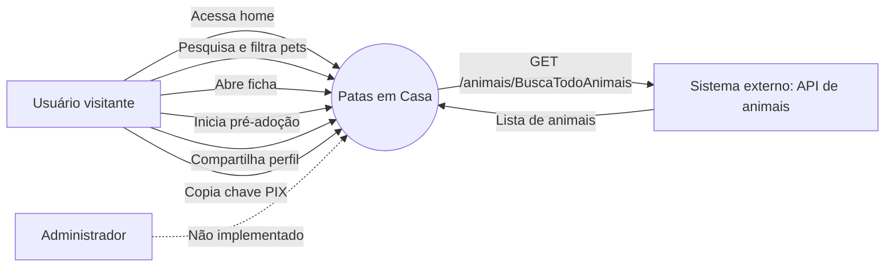
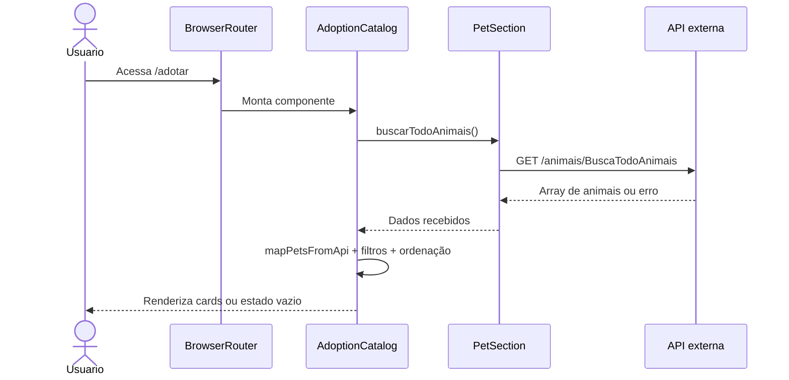
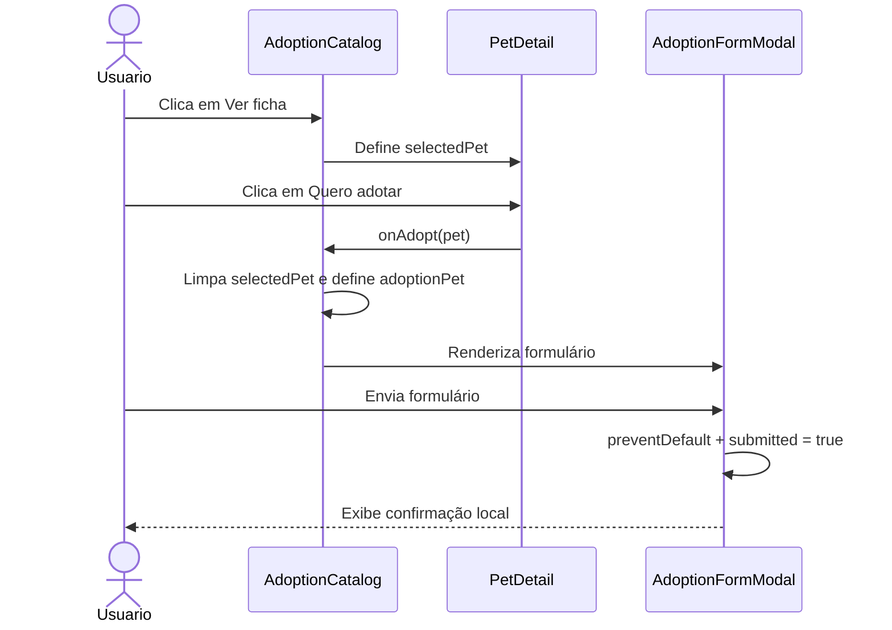
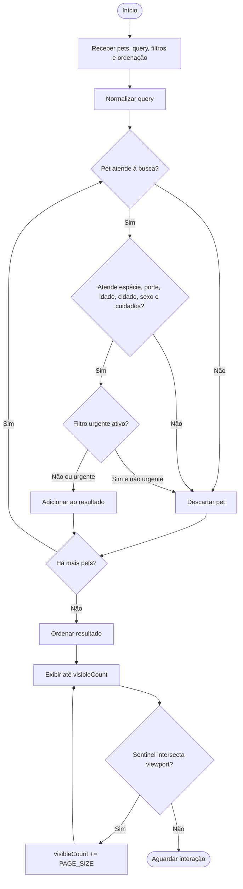
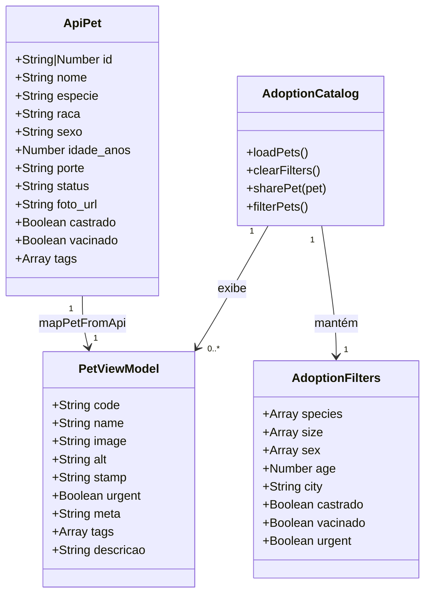
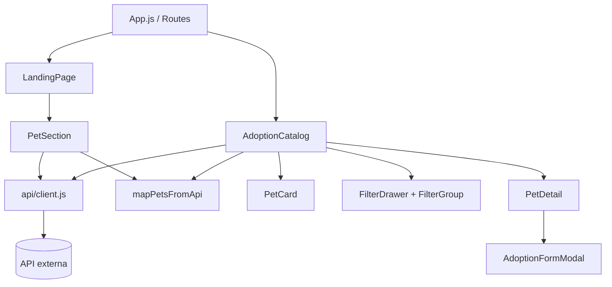
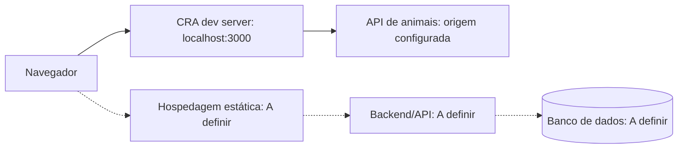

# Patas em Casa

Frontend React para divulgação institucional de uma ONG de proteção animal e encaminhamento de interessados ao processo de adoção responsável.

**Demo:** https://patas-em-casa-ruby.vercel.app

> **Estado atual:** este repositório contém o frontend (site público e painel administrativo). A API fica no repositório `Patas-em-Casa-BackEnd` (Node.js + Express + PostgreSQL); o endereço dela vem de `REACT_APP_API_URL`.

## Sumário

- [1. Visão geral](#1-visão-geral)
- [2. Requisitos](#2-requisitos)
- [3. Stack tecnológica](#3-stack-tecnológica)
- [4. Arquitetura e estrutura](#4-arquitetura-e-estrutura)
- [5. Diagramas técnicos](#5-diagramas-técnicos)
- [6. Instalação e execução](#6-instalação-e-execução)
- [7. Uso e API](#7-uso-e-api)
- [8. Testes](#8-testes)
- [9. Decisões técnicas](#9-decisões-técnicas)
- [10. CI/CD e deploy](#10-cicd-e-deploy)
- [11. Contribuição](#11-contribuição)

---

## 1. Visão geral

### Objetivo

O projeto centraliza a apresentação da ONG Patas em Casa e oferece uma jornada digital para que pessoas interessadas encontrem animais, consultem seus perfis e iniciem uma solicitação de pré-adoção.

### Público-alvo

- pessoas interessadas em adotar cães ou gatos;
- famílias procurando um animal compatível com sua rotina;
- doadores, padrinhos e voluntários;
- apoiadores que desejam conhecer o impacto da ONG.

### Funcionalidades principais

- landing page institucional em `/`;
- catálogo de adoção em `/adotar`;
- busca por nome, raça, código ou metadados;
- filtros por espécie, porte, idade, sexo, cidade, cuidados e urgência;
- ordenação por nome ou prioridade de urgência;
- carregamento incremental com `IntersectionObserver`;
- cards, ficha detalhada e animações com Framer Motion;
- formulário de pré-adoção enviado à API, com número de protocolo;
- painel administrativo com login, recuperação de senha e gestão de animais (com fotos), solicitações de adoção, adotantes, doações, voluntários, histórias e equipe;
- doação online integrada ao Mercado Pago (via API);
- compartilhamento via Web Share API ou cópia da URL;
- seção de doação com cópia da chave PIX;
- menu responsivo, navegação por âncoras e suporte a foco visível.

### Escopo

**Incluído:** site público (conteúdo, catálogo com filtros, ficha de pet, pré-adoção, doação e voluntariado) e painel administrativo autenticado consumindo a API.

**Fora deste repositório:** regras de negócio, banco de dados, envio de e-mail e integração de pagamentos ficam na [API](https://github.com/GabrielFagundes18/Patas-em-casa-backend).

---

## 2. Requisitos

Os requisitos abaixo foram inferidos exclusivamente do código existente.

### Requisitos funcionais

| ID | Descrição | Ator | Critério de aceite |
| --- | --- | --- | --- |
| RF-01 | Exibir a landing page institucional | Usuário | A rota `/` renderiza header, hero, estatísticas, vitrine, etapas, doação, histórias e footer. |
| RF-02 | Navegar até o catálogo de adoção | Usuário | Ações de adoção direcionam para `/adotar` sem exigir autenticação. |
| RF-03 | Consultar animais disponíveis | Sistema externo | O frontend executa `GET /animais/BuscaTodoAnimais` e normaliza a resposta. |
| RF-04 | Exibir estados de carregamento e erro | Sistema | Enquanto a consulta está pendente, a home exibe carregamento; em falha, exibe mensagem ou lista vazia. |
| RF-05 | Pesquisar animais | Usuário | O catálogo filtra por nome, código ou metadados após debounce de 300 ms. |
| RF-06 | Filtrar por características | Usuário | O catálogo aplica espécie, porte, idade, sexo, cidade, castração, vacinação e urgência. |
| RF-07 | Ordenar resultados | Usuário | O usuário pode escolher nome ou prioridade de urgência; a opção recente usa a ordenação padrão disponível. |
| RF-08 | Carregar mais resultados | Sistema | Ao aproximar-se do sentinel, o catálogo aumenta a quantidade visível em `PAGE_SIZE` itens. |
| RF-09 | Consultar ficha de animal | Usuário | “Ver ficha” abre detalhes com foto, status, metadados, tags e informações derivadas. |
| RF-10 | Iniciar pré-adoção | Usuário | O botão de adoção fecha a ficha e abre o formulário associado ao animal selecionado. |
| RF-11 | Registrar pré-adoção | Sistema | O envio faz `POST /api/v1/public/adoption-requests` e exibe a confirmação com o protocolo retornado. |
| RF-12 | Compartilhar perfil | Usuário | O sistema usa `navigator.share` quando disponível ou tenta copiar a URL atual. |
| RF-13 | Copiar chave PIX | Usuário | O botão usa `navigator.clipboard` e exibe confirmação temporária quando a cópia funciona. |
| RF-14 | Adaptar navegação para mobile | Usuário | O menu mobile abre, fecha e atualiza `aria-expanded` conforme a interação. |

### Requisitos não funcionais

| ID | Categoria | Descrição |
| --- | --- | --- |
| RNF-01 | Performance | A busca textual aguarda 300 ms antes de recalcular resultados; metas de latência da API: **[A definir]**. |
| RNF-02 | Performance | O catálogo inicia com oito cards e usa carregamento incremental; limite máximo de registros: **[A definir]**. |
| RNF-03 | Segurança | O painel exige sessão autenticada (`RequireAdminSession`); permissões por cargo são aplicadas pela API. CSP: **[A definir]**. |
| RNF-04 | Segurança | Há uso de `dangerouslySetInnerHTML` para o carimbo da raça; sanitização e origem confiável do conteúdo: **[A definir]**. |
| RNF-05 | Escalabilidade | O filtro ocorre no cliente e a API retorna a coleção completa; cache e paginação server-side: **[A definir]**. |
| RNF-06 | Disponibilidade | Existem estados de erro e lista vazia, mas não retry ou failover; SLA e redundância: **[A definir]**. |
| RNF-07 | Usabilidade | Há layout responsivo, foco visível, skip link e `prefers-reduced-motion`; auditoria WCAG: **[A definir]**. |
| RNF-08 | Manutenibilidade | O código é componentizado e usa ESLint via CRA; cobertura mínima obrigatória: **[A definir]**. |
| RNF-09 | Compatibilidade | O `browserslist` cobre versões recentes de Chrome, Firefox e Safari; versões mínimas de Node/API: **[A definir]**. |
| RNF-10 | Observabilidade | Logs, métricas, rastreamento de erros e alertas: **[A definir]**. |

### Regras de negócio

| Regra | Implementação |
| --- | --- |
| O catálogo começa sem filtros, com os casos urgentes primeiro. | `createInitialFilters` e `sortPets` em `src/features/catalog/catalogFilters.js` |
| A idade é filtrada por faixas (filhote, jovem, adulto, idoso); animal sem idade cadastrada não entra em nenhuma faixa. | `ageGroupOf` em `src/features/catalog/catalogFilters.js` |
| Espécie, porte, sexo, idade e temperamento aceitam múltiplas seleções. | `src/features/catalog/FilterDrawer/FilterDrawer.jsx` e `filterPets` |
| Castração e vacinação são condições cumulativas. | `filterPets` em `src/features/catalog/catalogFilters.js` |
| O filtro urgente retorna apenas pets urgentes. | `filterPets` em `src/features/catalog/catalogFilters.js` |
| Busca, filtros e ordenação ficam no endereço (`/adotar?especie=gato&urgente=1`). | `readCatalogParams` e `writeCatalogParams` em `catalogFilters.js` |
| `status === "urgente"` vira `urgent: true`. | `mapPetFromApi` |
| Idade menor que um ano é exibida em meses. | `formatarIdade` |
| A lista visível é limitada a oito itens por lote. | `PAGE_SIZE` em `catalogOptions.js` |
| O formulário não envia dados ao servidor; altera apenas estado local. | `AdoptionFormModal.jsx` |

---

## 3. Stack tecnológica

| Tecnologia | Versão declarada | Uso |
| --- | --- | --- |
| JavaScript/JSX | ES Modules | linguagem e componentes |
| React | `^19.2.8` | interface componentizada |
| React DOM | `^19.2.8` | renderização no navegador |
| React Router DOM | `^6.30.0` | rotas da SPA |
| `react-scripts` | `5.0.1` | desenvolvimento, build e testes |
| Axios | `^1.20.0` | cliente HTTP |
| Framer Motion | `^13.1.0` | animações e presença de modais |
| lucide-react | `^1.29.0` | ícones |
| Testing Library | versões no `package.json` | testes de componentes e DOM |
| Jest | via CRA | execução da suíte |
| CSS nativo | sem versão | tokens, layout e responsividade |

`gsap`, `@gsap/react` e `web-vitals` estão declarados, mas não há uso ativo identificado no fluxo atual.

### Banco de dados

Nenhum banco, ORM, migration ou schema está presente. A persistência do backend externo é **[A definir]**.

### Integrações externas

- API HTTP: `http://localhost:3000/animais/BuscaTodoAnimais`;
- Google Fonts via `@import` em `src/styles/globals.css`;
- imagens remotas de histórias via URLs do Unsplash;
- APIs nativas opcionais: `IntersectionObserver`, `navigator.share` e `navigator.clipboard`.

### Ferramentas

- `npm start`: desenvolvimento;
- `npm run build`: build de produção em `build/`;
- `npm test`: Jest/React Testing Library;
- ESLint integrado ao preset `react-app`;
- nenhum script de lint separado está configurado.

---

## 4. Arquitetura e estrutura

O projeto é uma SPA React organizada por componentes e páginas. Não há MVC completo, arquitetura hexagonal, microsserviços ou backend neste repositório.

As responsabilidades observáveis são:

1. apresentação: JSX e CSS;
2. orquestração de tela: `pages/` e `App.js`;
3. integração HTTP: `services/` e consulta da vitrine;
4. normalização: `mapPetFromApi` e `mapPetsFromApi` em `src/shared/utils/petMapper.js`;
5. dados estáticos: constantes de cada funcionalidade e `src/shared/constants/organization.js` (dados da ONG).

### Árvore de diretórios

```text
Patas-em-Casa/
├── public/index.html                       # HTML base do CRA
├── jsconfig.json                           # baseUrl "src": imports absolutos (api/..., shared/..., features/...)
├── src/
│   ├── index.js                            # bootstrap React + BrowserRouter (caminho exigido pelo CRA)
│   ├── setupTests.js                       # configuração do Jest (caminho exigido pelo CRA)
│   ├── app/                                # App.js (rotas), App.test.js e NotFoundPage
│   ├── api/                                # client.js (Axios) e um módulo por recurso: animals, adoptions,
│   │                                       #   content, donations, volunteers
│   ├── shared/                             # o que mais de uma funcionalidade usa
│   │   ├── components/layout/              # Header, Footer, PublicLayout
│   │   ├── components/                     # AnimalCard, PetPhoto, PixKey
│   │   ├── constants/organization.js       # dados públicos da ONG (contato, Pix, CNPJ)
│   │   ├── hooks/                          # useDialog, useAvailableAnimals, useAdoptionSteps
│   │   └── utils/                          # petMapper, petText, sharePet (+ testes)
│   ├── features/                           # uma pasta por funcionalidade do site público
│   │   ├── home/                           # LandingPage + sections/ (Hero, StatsStrip, PetSection, HowItWorks,
│   │   │                                   #   Donation, Stories)
│   │   ├── catalog/                        # AdoptionCatalog, FilterDrawer, catalogFilters, favoritos
│   │   ├── animal-profile/                 # AnimalProfilePage (ficha /animais/:id)
│   │   ├── adoption/                       # AdoptionFormModal, HowAdoptionWorksPage, adoptionGuide
│   │   ├── donation/                       # DonationPage, DonationReturnPage, CancelSubscriptionPage
│   │   └── volunteers/                     # VolunteerSignup e áreas de voluntariado
│   ├── admin/                              # painel: adoptions, adopters, animals, donations, team, stories,
│   │                                       #   volunteers, dashboard, layout, security, shared, constants, styles
│   ├── assets/                             # imagens importadas (fundo.webp)
│   └── styles/globals.css                  # tokens e estilos globais
├── build/                                  # artefato gerado; não é fonte
├── package.json                            # scripts e dependências
├── package-lock.json                       # lockfile npm
└── README.md                               # documentação técnica
```

### Fluxo de comunicação

```text
index.js -> BrowserRouter -> app/App.js
                          ├── / -> features/home/LandingPage
                          │     └── useAvailableAnimals -> api/animals -> API
                          ├── /adotar -> features/catalog/AdoptionCatalog
                          │     ├── useAvailableAnimals -> api/animals -> API
                          │     ├── catalogFilters (busca, filtros e ordenação no endereço)
                          │     └── AnimalCard -> /animais/:id
                          ├── /animais/:id -> features/animal-profile/AnimalProfilePage
                          │     └── AdoptionFormModal -> api/adoptions -> API
                          ├── /como-funciona, /doar, /doar/retorno, /doar/cancelar -> features/adoption e features/donation
                          └── /admin/* -> admin/ (carregado sob demanda)
```

---

## 5. Diagramas técnicos

### 5.1 Casos de uso

Não há ator administrador nem autenticação implementados.



### 5.2 Sequência: consulta do catálogo



### 5.3 Sequência: pré-adoção

Não existe autenticação/login no código atual. O fluxo implementado é local:



### 5.4 Atividades: filtragem e carregamento incremental



### 5.5 Entidades e classes lógicas

Este diagrama representa contratos observados no frontend, não um schema de banco.



### 5.6 Componentes



### 5.7 Implantação

A infraestrutura de produção não está declarada. O diagrama abaixo representa o desenvolvimento verificável e marca o restante como `[A definir]`.



---

## 6. Instalação e execução

### Pré-requisitos

- Node.js e npm instalados. Versões mínimas oficiais: **[A definir]**; Node.js 18+ é uma recomendação operacional.
- API externa disponível para carregar animais reais.
- navegador compatível com React 19 e as APIs DOM usadas pelo projeto.

### Instalação

```bash
git clone <URL_DO_REPOSITORIO>
cd Patas-em-Casa
npm install
```

### Desenvolvimento

```bash
npm start
```

O CRA normalmente abre `http://localhost:3000`. A URL base da API vem de `REACT_APP_API_URL` (padrão `http://localhost:4000`), lida em `src/api/client.js`. Depois de criar ou alterar o `.env` ou o `jsconfig.json`, reinicie o `npm start`.

### Produção

```bash
npm run build
npx serve -s build
```

O primeiro comando gera os arquivos estáticos em `build/`. Servidor, domínio, HTTPS, CDN e processo de publicação são **[A definir]**.

### Variáveis de ambiente

Copie `.env.example` para `.env` e ajuste:

```env
# Endereço da API (repositório Patas-em-Casa-BackEnd).
REACT_APP_API_URL=http://localhost:4000
```

O `.env` não vai para o Git (ver `.gitignore`).

---

## 7. Uso e API

### Rotas do frontend

| Método | Rota | Resultado |
| --- | --- | --- |
| GET | `/` | Landing page institucional; o curinga do Router também cai nesta tela. |
| GET | `/adotar` | Catálogo de adoção com busca, filtros, ficha e formulário de pré-adoção. |

### Endpoint consumido

| Método | Rota | Parâmetros | Resposta |
| --- | --- | --- | --- |
| GET | `/animais/BuscaTodoAnimais` | Nenhum parâmetro usado pelo frontend | Array de objetos de animal. |

```bash
curl http://localhost:3000/animais/BuscaTodoAnimais
```

```json
[
  {
    "id": "nino-001",
    "nome": "Nino",
    "especie": "cachorro",
    "raca": "Vira-lata",
    "sexo": "macho",
    "idade_anos": 2,
    "porte": "medio",
    "status": "disponivel",
    "foto_url": "https://example.com/nino.jpg",
    "castrado": true,
    "vacinado": true,
    "descricao": "Nino é um cachorro carinhoso."
  }
]
```

O contrato de status HTTP, códigos de erro, retry e mensagens estruturadas da API é **[A definir]**. Em falha capturada, o frontend usa lista vazia ou mensagem local.

### Modelo normalizado

```js
{
  code: "NINO-001",
  name: "Nino",
  image: "https://example.com/nino.jpg",
  alt: "Nino, cachorro da raça Vira-lata",
  stamp: "Vira-lata",
  urgent: false,
  meta: "Cachorro • Vira-lata • 2 anos • Porte médio",
  tags: ["Macho", "Castrado", "Vacinado"],
  descricao: "Nino é um cachorro carinhoso."
}
```

O formulário de pré-adoção não possui endpoint `POST`; o envio altera somente o estado React `submitted`.

---

## 8. Testes

### Execução

```bash
npm test
npm test -- --watchAll=false
```

### Cobertura atual

Os testes ficam ao lado do código (`*.test.js`) e rodam com `npm test`. Entre eles:

- `src/app/App.test.js`: Home, jornada catálogo → ficha → formulário, rotas do painel e 404;
- `src/features/*/`: Home, catálogo (filtros, favoritos, endereço), ficha, Como funciona, doação e formulário de adoção;
- `src/shared/utils/` e `src/features/catalog/catalogFilters.test.js`: regras puras (filtros, textos, tempo de espera);
- `src/admin/*/`: telas do painel.

### Estratégia

- `buscarTodoAnimais` é mockado para evitar rede;
- `IntersectionObserver` recebe um stub no ambiente Jest;
- `MemoryRouter` simula navegação;
- Testing Library consulta a árvore acessível e simula interações.

### Estado conhecido

Não há relatório de cobertura configurado nem testes de integração com a API real.

---

## 9. Decisões técnicas (ADR)

### ADR-001: React com Create React App

- **Contexto:** a interface possui duas telas e diversos componentes interativos.
- **Decisão:** usar React 19 e scripts do Create React App.
- **Alternativas:** HTML/JavaScript sem framework, Vite ou Next.js.
- **Consequências:** setup simples e familiar, mas sem SSR e com menor flexibilidade que bundlers atuais.

### ADR-002: SPA com duas rotas

- **Contexto:** home e catálogo compartilham navegação e dependências.
- **Decisão:** usar `BrowserRouter`, `Routes` e `Route` para `/adotar` e fallback da home.
- **Alternativas:** múltiplos HTML ou routing de Next.js.
- **Consequências:** navegação client-side simples; hospedagem precisa fallback para `index.html`.

### ADR-003: normalização na fronteira da API

- **Contexto:** a API usa nomes e códigos diferentes dos componentes.
- **Decisão:** adaptar registros com `mapPetFromApi`/`mapPetsFromApi`.
- **Alternativas:** usar contrato bruto em cada componente ou adicionar schema formal.
- **Consequências:** componentes mais simples, mas validação formal do payload ainda é **[A definir]**.

### ADR-004: filtro no cliente com debounce

- **Contexto:** o catálogo precisa responder rapidamente a busca e filtros.
- **Decisão:** usar `useMemo` para filtrar estado local e debounce de 300 ms na busca.
- **Alternativas:** filtro no backend, biblioteca de busca ou paginação server-side.
- **Consequências:** simples para coleções pequenas/médias; limites de memória e escala são **[A definir]**.

### ADR-005: formulário de pré-adoção local

- **Contexto:** a jornada visual precisa existir antes do backend de candidaturas.
- **Decisão:** impedir submit padrão e alternar para confirmação local.
- **Alternativas:** endpoint POST, serviço de e-mail ou armazenamento local.
- **Consequências:** funciona sem infraestrutura, mas nenhuma solicitação é persistida.

---

## 10. CI/CD e deploy

Não foram identificados workflows CI, Dockerfiles, manifests de Kubernetes, ambientes de staging ou scripts de deploy.

### Pipeline recomendado

Esta é uma proposta, não uma configuração existente:

1. instalar com `npm ci`;
2. executar `npm test -- --watchAll=false`;
3. executar `npm run build`;
4. publicar `build/` em hospedagem estática;
5. configurar proxy/URL da API e fallback da SPA;
6. executar smoke test pós-deploy.

Ferramenta CI, ambientes, aprovação manual, rollback, domínio, CDN e monitoramento: **[A definir]**.

---

## 11. Contribuição

### Branches

Não há estratégia formal declarada. Recomenda-se usar branches curtas:

```text
feature/filtros-catalogo
fix/teste-hero
docs/readme-tecnico
```

Modelo oficial de branches: **[A definir]**.

### Commits

Não há hook ou validador configurado. Recomenda-se Conventional Commits:

```text
feat: adiciona filtro por cidade
fix: corrige carregamento do catálogo
docs: atualiza documentação técnica
test: cobre abertura do formulário
```

### Pull requests

Antes de abrir um PR:

1. descreva problema e solução;
2. liste impactos e limitações;
3. execute `npm test -- --watchAll=false`;
4. execute `npm run build`;
5. inclua screenshots em mudanças visuais;
6. informe dependências externas, como a API de animais.

Regras obrigatórias de revisão, aprovação mínima e template de PR: **[A definir]**.

### Checklist

- [ ] Não incluir segredos ou credenciais.
- [ ] Preservar a normalização do contrato da API.
- [ ] Cobrir novos fluxos com testes.
- [ ] Verificar responsividade e foco por teclado.
- [ ] Atualizar o README quando o contrato da API mudar.
- [ ] Executar testes e build antes do merge.
