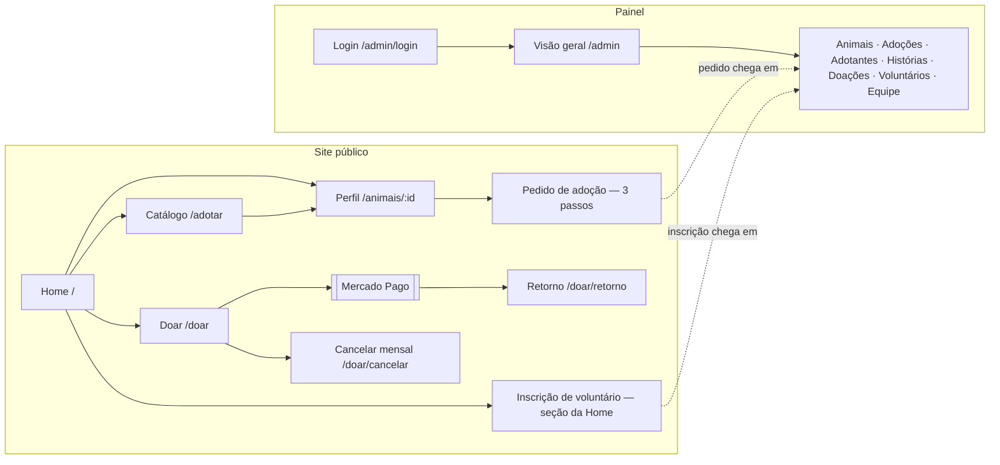

# 1. Visão geral

## O que o sistema faz

O front-end Patas em Casa é uma **SPA em React** com duas partes no mesmo pacote:

| Parte | Para quem | O que oferece |
| --- | --- | --- |
| **Site público** (`/`, `/adotar`, `/animais/:id`, `/como-funciona`, `/doar…`) | Visitantes: quem quer adotar, doar ou ser voluntário | Home institucional com números, vitrine e histórias; catálogo com busca, filtros, ordenação e favoritos; perfil de cada animal com galeria; pedido de adoção em 3 passos; página "Como funciona"; doação online (única ou mensal) pelo Mercado Pago; cancelamento da doação mensal; inscrição de voluntário |
| **Painel administrativo** (`/admin…`) | Equipe da ONG (5 cargos com permissões diferentes) | Login, recuperação de senha e convite; indicadores; animais (cadastro, status, fotos); pedidos de adoção (triagem, agenda, decisão); adotantes (dados mascarados, LGPD); doações e doações mensais; histórias; voluntários; equipe e acessos |

Todos os dados vêm da API do repositório `Patas-em-Casa-BackEnd` (`/api/v1`). O front não tem banco próprio; guarda no
navegador só a sessão do painel e os favoritos do catálogo (ver [6. Estado](06-estado.md)).

## Principais fluxos

1. **Adotar:** Home ou catálogo → perfil do animal → "Quero adotar" → formulário (seus dados → lar e rotina →
   visita e envio) → protocolo `PAC-…`. A equipe vê o pedido em *Adoções*, agenda visita/entrevista e aprova ou recusa.
2. **Doar:** Home (escolhe tipo e valor) ou `/doar` → nome e e-mail → redirecionamento ao Mercado Pago → volta para
   `/doar/retorno`, que consulta a situação. Alternativa sempre visível: chave Pix.
3. **Voluntariar:** formulário na Home → protocolo `VOL-…` → aparece em *Voluntários* como inativo (em triagem).
4. **Painel:** login → o menu mostra só os módulos permitidos pelo cargo (lista de permissões vinda de `/api/v1/me`).

## Stack

Versões instaladas (`node_modules`) conferidas em 2026-10-07; `package.json` usa faixas `^`.

| Tecnologia | Versão | Para que é usada |
| --- | --- | --- |
| React / React DOM | 19.2.8 | Interface (componentes de função e hooks); `createRoot` em `src/index.js` |
| Create React App (`react-scripts`) | 5.0.1 | Servidor de desenvolvimento, build (webpack/Babel), Jest e ESLint (`react-app`) |
| React Router DOM | 6.30.0 | Rotas no cliente (`BrowserRouter`, `Routes`, `Outlet`, `useSearchParams`, `useNavigate`) |
| Axios | 1.20.0 | Cliente HTTP com interceptors (token, renovação de sessão) — `src/api/client.js` |
| Framer Motion | 13.1.0 | Animações de entrada (Home, gaveta de filtros, formulário de adoção) e `MotionConfig reducedMotion="user"` |
| Lucide React | 1.29.0 | Ícones SVG |
| Testing Library (`react`, `dom`, `jest-dom`) | 16.3.2 / 10.4.1 / 6.9.1 | Testes de componentes (rodam no Jest do CRA) |
| CSS puro | — | Um arquivo `.css` por componente + `src/styles/globals.css` e `src/admin/styles/admin.css` (sem CSS Modules, Tailwind ou styled-components) |
| Google Fonts | — | Fraunces, Inter, IBM Plex Mono (e Work Sans, importada sem uso) via `@import` em `globals.css` |

Sem TypeScript, sem biblioteca de estado (Redux/Zustand/Context), sem biblioteca de formulários e sem biblioteca de
gráficos (os gráficos do painel são CSS/SVG próprios).
