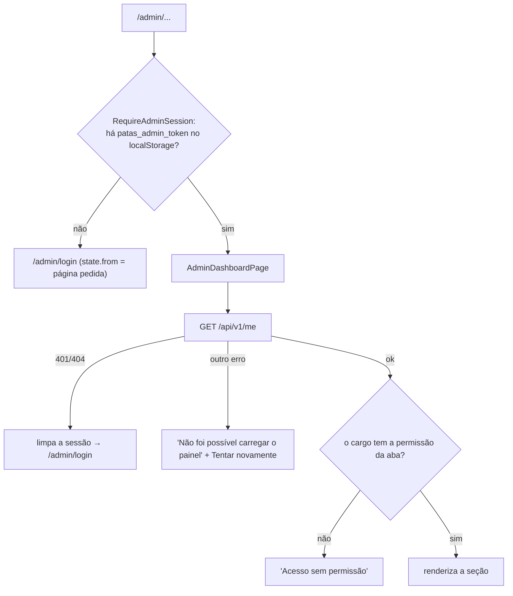

# 4. Rotas e páginas

Rotas definidas em `src/app/App.js` com React Router 6 (`BrowserRouter` em `src/index.js`). As páginas do painel são
carregadas **sob demanda** (`React.lazy` + `Suspense` com "Carregando..."), então quem visita só o site não baixa o
código do painel.

## Tabela de rotas

| # | Caminho | Componente | Protegida | Permissão exigida | Carga |
| --- | --- | --- | :---: | --- | --- |
| 1 | `/` | `LandingPage` | não | — | imediata |
| 2 | `/adotar` | `AdoptionCatalog` | não | — | imediata |
| 3 | `/animais/:id` | `AnimalProfilePage` | não | — | imediata |
| 4 | `/como-funciona` | `HowAdoptionWorksPage` | não | — | imediata |
| 5 | `/doar` | `DonationPage` | não | — | imediata |
| 6 | `/doar/retorno` | `DonationReturnPage` | não | — | imediata |
| 7 | `/doar/cancelar` | `CancelSubscriptionPage` | não | — | imediata |
| 8 | `/admin/login` | `AdminLoginPage` | não (redireciona a `/admin` se já há token) | — | lazy |
| 9 | `/admin/esqueci-senha` | `AdminForgotPasswordPage` | não | — | lazy |
| 10 | `/admin/redefinir-senha` | `AdminResetPasswordPage` | não (exige `?token=`) | — | lazy |
| — | *(sem caminho)* | `RequireAdminSession` | — | Rota "moldura" das 8 abaixo: sem token salvo, vai para `/admin/login` guardando a página pedida | imediata |
| 11 | `/admin` | `AdminDashboardPage` → `DashboardOverview` | sim | nenhuma no front (a API exige `dashboard:read`, que todos os cargos têm) | lazy |
| 12 | `/admin/animais` | `AdminDashboardPage activeTab="animais"` → `AnimalsPage` | sim | `animals:read` | lazy |
| 13 | `/admin/adocoes` | … → `AdoptionsPage` | sim | `adoptions:read` | lazy |
| 14 | `/admin/adotantes` | … → `AdoptersPage` | sim | `adopters:read` | lazy |
| 15 | `/admin/historias` | … → `StoriesPage` | sim | `stories:read` | lazy |
| 16 | `/admin/doacoes` | … → `DonationsPage` | sim | `donations:read` | lazy |
| 17 | `/admin/voluntarios` | … → `VolunteersPage` | sim | `volunteers:read` | lazy |
| 18 | `/admin/configuracoes` | … → `TeamPage` | sim | `team:read` | lazy |
| 19 | `*` | `NotFoundPage` | não | — | imediata |

**Parâmetros de URL usados pelas páginas:** `/adotar?q=&especie=&porte=&sexo=&idade=&temperamento=&urgente=1&castrado=1&vacinado=1&favoritos=1&ordem=`
(e `?pet=<id>`, link antigo que redireciona ao perfil); `/doar?tipo=unica|recorrente&valor=`;
`/doar/retorno?ref=` ou `?assinatura=`; `/doar/cancelar?token=`; `/admin/redefinir-senha?token=&convite=1`;
listas do painel `?page=&pageSize=&q=&status=…` (filtros na URL).

**Âncoras da Home** (links do menu e rodapé): `/#adotar`, `/#como-funciona`, `/#ajudar`, `/#historias`, `/#voluntariado`.

### Como a proteção funciona

A verificação no navegador só esconde telas; **a autorização real é da API** (cada chamada exige token válido e a
permissão do cargo). Detalhes em [8. Autenticação](08-autenticacao.md).

---

## Páginas do site público

### `/` — `LandingPage` (`src/features/home/LandingPage.jsx`)

| | |
| --- | --- |
| Objetivo | Apresentar a ONG e levar a adotar, doar ou ser voluntário |
| Componentes | `Header`, `Hero`, `StatsStrip`, `PetSection` (com `AnimalCard`), `HowItWorks`, `Donation` (com `PixKey`), `Stories` (com `PetPhoto`), `VolunteerSignup`, `Footer`; `MotionConfig` do Framer Motion |
| Dados | `useAvailableAnimals` → todos os animais disponíveis (uma busca alimenta o destaque e a vitrine); `useAdoptionSteps` → etapas; `StatsStrip` → `/public/stats`; `Stories` → `/public/stories?pageSize=6` |
| Ações | Ir ao catálogo, perfil, "Como funciona", doação (com tipo e valor pré-escolhidos), enviar inscrição de voluntário, copiar a chave Pix |
| Comportamentos | Barra de progresso de rolagem (aparece após 220 px); "Pular para o conteúdo"; revelação das seções com `IntersectionObserver` (desligada com "reduzir movimento"); rola até o `#hash` da URL ao abrir |

### `/adotar` — `AdoptionCatalog` (`src/features/catalog/AdoptionCatalog.jsx`)

| | |
| --- | --- |
| Objetivo | Encontrar um animal: busca, filtros, ordenação, favoritos e grade |
| Componentes | `PublicLayout`, `AnimalCard`, `FilterDrawer` (com `FilterGroup`), ícones Lucide, `AnimatePresence` |
| Dados | `useAvailableAnimals` (todas as páginas de `/public/animals`); favoritos do `localStorage` (`useFavorites`) |
| Ações | Buscar (aplica após 300 ms sem digitar), filtros rápidos (Cães, Gatos, Urgentes, Filhotes, Porte pequeno), gaveta de filtros (espécie, porte, idade, sexo, temperamento, castrado, vacinado, urgentes), remover filtro por chip, limpar tudo, ordenar (4 opções), favoritar, compartilhar, "Mostrar mais" (lotes de 8, também automático ao rolar), tentar de novo após erro |
| Estados | carregando (8 esqueletos), erro com "Tentar novamente", catálogo vazio, sem favoritos, sem resultado; convite para doar/voluntariar no fim da lista |
| Observações | Filtragem e ordenação **no navegador**; tudo fica na URL (`replace`, sem poluir o histórico) |

### `/animais/:id` — `AnimalProfilePage` (`src/features/animal-profile/AnimalProfilePage.jsx`)

| | |
| --- | --- |
| Objetivo | Página própria de cada animal, para divulgar e pedir a adoção |
| Componentes | `PublicLayout`, `Gallery` (interno), `AdoptionFormModal` |
| Dados | `GET /public/animals/:id` (com fotos e temperamento) → `mapPetFromApi` |
| Ações | Trocar a foto da galeria, "Quero adotar" (abre o formulário), "Compartilhar" (Web Share ou copiar link), ir ao catálogo, ir a "Como funciona" |
| Estados | carregando; 410 → "já encontrou um lar" (mensagem da API); 404/422 → "Não encontramos este animal"; outro erro → "Tentar novamente"; atualiza `document.title` com o nome |

### `/como-funciona` — `HowAdoptionWorksPage` (`src/features/adoption/HowAdoptionWorksPage.jsx`)

| | |
| --- | --- |
| Objetivo | Explicar o processo antes do pedido |
| Componentes | `PublicLayout`; textos de `adoptionGuide.js`; `ORGANIZACAO.email` |
| Dados | `useAdoptionSteps` (etapas da API ou padrão) |
| Ações | Ver animais, abrir e-mail para a equipe (`mailto:`), expandir dúvidas (`
`) |

### `/doar` — `DonationPage` (`src/features/donation/DonationPage.jsx`)

| | |
| --- | --- |
| Objetivo | Iniciar doação online pelo Mercado Pago |
| Componentes | `PublicLayout`, `PixKey` |
| Dados | Lê `?tipo=` e `?valor=` (vindos da Home) |
| Ações | Escolher única/mensal, valor sugerido (25/50/100/200) ou livre (R$ 5 a 10.000), informar nome e e-mail, enviar → `POST /public/donations/checkout` → redireciona para `checkout_url`; copiar Pix; ir para "Cancelar doação mensal" |
| Estados | erro da API (com detalhes); com 503 o título lateral muda para "Doe agora pelo Pix" |

### `/doar/retorno` — `DonationReturnPage` (`src/features/donation/DonationReturnPage.jsx`)

| | |
| --- | --- |
| Objetivo | Agradecer e mostrar a situação da doação na volta do Mercado Pago |
| Componentes | `PublicLayout` |
| Dados | `GET /public/donations/status/:ref` com `?ref=` ou `?assinatura=`; enquanto `pendente`, consulta de novo a cada 3 s, até 6 tentativas |
| Ações | "Tentar de novo" (se falhou), "Conhecer os animais" |
| Estados | conferindo; não encontrada (sem referência ou erro); mensagens para `confirmada`, `ativa`, `pendente`, `falhou`, `cancelada` |

### `/doar/cancelar` — `CancelSubscriptionPage` (`src/features/donation/CancelSubscriptionPage.jsx`)

| | |
| --- | --- |
| Objetivo | O doador cancelar a doação mensal sem login |
| Componentes | `PublicLayout` |
| Dados | `?token=` do e-mail |
| Ações | Com token: "Sim, cancelar" → `POST …/subscriptions/cancel`. Sem token: informar e-mail → `POST …/subscriptions/cancel-link` (resposta neutra) |

### `*` — `NotFoundPage` (`src/app/NotFoundPage.jsx`)

Página 404 com `PublicLayout` e links para o catálogo e a Home. Sem dados.

---

## Páginas de acesso ao painel

### `/admin/login` — `AdminLoginPage` (`src/admin/security/AdminLoginPage.jsx`)

| | |
| --- | --- |
| Objetivo | Entrar no painel |
| Componentes | `AdminAuthShell` |
| Dados | `location.state` (`from`, `sessaoExpirada`, `senhaDefinida`) para avisos e retorno |
| Ações | E-mail + senha → `POST /auth/login`; salva token e usuário no `localStorage`; volta para a página pedida ou `/admin`; link "Esqueci minha senha" |

### `/admin/esqueci-senha` — `AdminForgotPasswordPage`

E-mail → `POST /auth/forgot-password`; mostra a resposta neutra da API. Link para o login. Usa `AdminAuthShell`.

### `/admin/redefinir-senha` — `AdminResetPasswordPage`

Com `?token=`: nova senha + confirmação (10 a 72 caracteres; iguais) → `POST /auth/reset-password` → login com aviso
"Senha definida". `?convite=1` troca os textos para "Crie sua senha". Sem token: "Link incompleto". Link expirado
(`LINK_INVALIDO`): oferece "Pedir um novo link".

---

## Painel (rotas protegidas)

### `AdminDashboardPage` (`src/admin/AdminDashboardPage.jsx`) — prop `activeTab`

Página única de todas as rotas `/admin…`. Valida a sessão em `GET /me`, escuta o evento de sessão expirada, faz logout
(`POST /auth/logout` + limpeza local) e escolhe a seção:

| `activeTab` | Seção | Objetivo | Dados carregados | Ações |
| --- | --- | --- | --- | --- |
| `dashboard` (padrão) | `DashboardOverview` | Indicadores da ONG | `GET /dashboard/summary` ao abrir e a cada 60 s; "Atualizar" pede dados frescos | Buscar animal (vai para Animais com `?q=`), trocar fonte/período do gráfico mensal, filtrar e exportar a agenda (CSV), links para pedidos |
| `animais` | `AnimalsPage` | Cadastro de animais | `GET /animals` com filtros/ordem/página na URL | Filtrar (9 critérios), ordenar por nome, cadastrar, editar, mudar status (pede motivo quando a API exige), excluir, enviar/organizar fotos |
| `adocoes` | `AdoptionsPage` | Triagem de pedidos | `GET /adoption-requests` (filtros na URL); detalhe `GET /adoption-requests/:id` | Filtrar, abrir detalhe, revelar contatos, agendar/remarcar/cancelar/concluir visita ou entrevista, aprovar, recusar |
| `adotantes` | `AdoptersPage` | Candidatos e LGPD | `GET /adopters`; ficha `GET /adopters/:id` | Filtrar, exportar CSV, revelar contatos, editar, exportar dados do titular (JSON), anonimizar, excluir |
| `historias` | `StoriesPage` | Depoimentos do site | `GET /stories`; animais adotados para o vínculo | Filtrar publicada/rascunho, criar, editar, publicar/despublicar, excluir |
| `doacoes` | `DonationsPage` | Entradas financeiras | `GET /donations`, `GET /donations/summary`, `GET /donations/subscriptions` | Filtrar, registrar doação manual, editar (só manuais não canceladas), listar e cancelar doações mensais |
| `voluntarios` | `VolunteersPage` | Voluntários | `GET /volunteers` | Filtrar, adicionar voluntário |
| `configuracoes` | `TeamPage` | Equipe e acessos | `GET /users` | Filtrar, adicionar (senha ou convite), editar (nome, e-mail, cargo, ativo), definir nova senha, reenviar convite |

Os componentes de cada seção estão em [5. Componentes](05-componentes/README.md).
