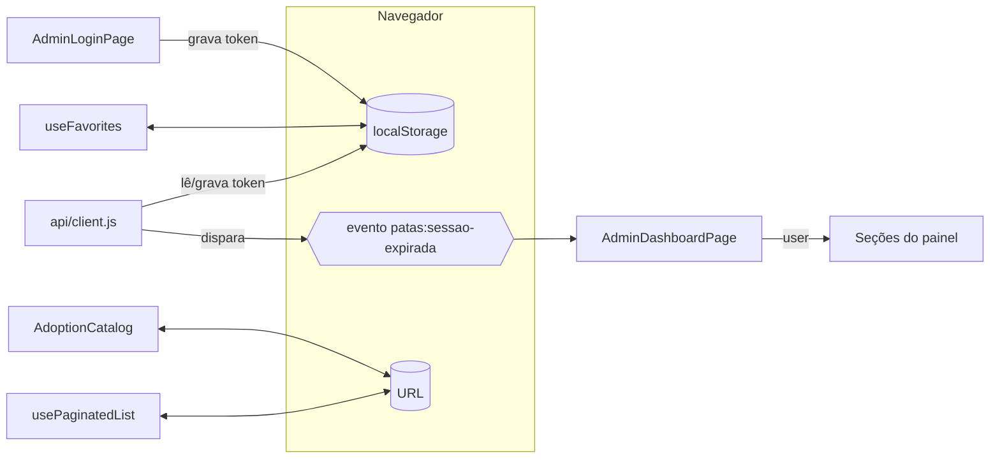

# 6. Gerenciamento de estado

**Não há store global** (Redux, Zustand, MobX) **nem React Context** no projeto. O estado vive em quatro lugares:

| Onde | O que guarda | Quem lê | Quem altera |
| --- | --- | --- | --- |
| **Estado local** (`useState`/`useRef`) | Formulários, carregamento, erros, diálogos abertos, listas carregadas | O próprio componente e filhos via props | O próprio componente |
| **URL** (`useSearchParams`) | Busca, filtros, ordenação do catálogo; filtros e página das listas do painel; escolha de doação vinda da Home; tokens de links (`?token=`) | `AdoptionCatalog`, telas do painel (via `usePaginatedList` ou direto em `AnimalsPage`), `DonationPage`, `DonationReturnPage`, `CancelSubscriptionPage`, `AdminResetPasswordPage` | As mesmas telas (`setSearchParams`) e links |
| **`localStorage`** | Sessão do painel e favoritos (abaixo) | `api/client.js`, `RequireAdminSession`, `AdminLoginPage`, `AdminDashboardPage`, `useFavorites` | `AdminLoginPage`, `api/client.js`, `useFavorites` |
| **Variáveis de módulo** | `refreshPromise` (renovação em andamento, `api/client.js`); `openDialogs`/`overflowBeforeDialogs` (contador de diálogos para travar a rolagem, `useDialog.js`) | Os próprios módulos | Os próprios módulos |

Comunicação entre partes desconectadas: o evento global `window` **`patas:sessao-expirada`** (`SESSION_EXPIRED_EVENT`),
disparado pelo interceptor do Axios e ouvido por `AdminDashboardPage`.

## `localStorage`

| Chave | Conteúdo | Gravado por | Lido por | Removido por |
| --- | --- | --- | --- | --- |
| `patas_admin_token` | Token de acesso JWT (texto) | `AdminLoginPage` (após login); `api/client.js` (`storeSession` após renovar) | Interceptor de requisição (`Authorization: Bearer`), `RequireAdminSession`, `AdminLoginPage`, `AdminDashboardPage` | `clearSession()` — logout, `/me` com 401/404, renovação recusada |
| `patas_admin_user` | JSON do usuário (`{ id, nome, email, cargo, role, permissions }`) | `AdminLoginPage`; `storeSession` | ⚠️ Nenhum código lê esta chave (o painel sempre busca `/me`) | `clearSession()` |
| `patas:favoritos` | JSON `string[]` com ids de animais | `useFavorites` | `useFavorites` (também ouve o evento `storage` para sincronizar abas) | Ninguém (só desmarcando) |

Todos os acessos ao `localStorage` estão em `try/catch` (navegação privada restrita), **exceto** os de
`AdminLoginPage` e `AdminDashboardPage`, que chamam `localStorage.getItem` direto (ver [14](14-pontos-de-atencao.md)).

## Estado por fluxo

| Fluxo | Estado | Ciclo |
| --- | --- | --- |
| Animais do site | `useAvailableAnimals` (`{ pets, loading, error }` + `reload`) | Uma busca por montagem da página; a Home e o catálogo buscam cada um a sua (não há cache entre páginas) |
| Etapas da adoção | `useAdoptionSteps` (começa com as etapas padrão) | Trocadas pelas da API quando chegam |
| Catálogo | URL (`query`, `filters`, `sort`) + `inputQuery`, `visibleCount`, `drawerOpen`, `notice` | Filtragem/ordenação derivadas com `useMemo` |
| Pedido de adoção | `form`, `step`, `errors`, `pedido`, `erro` no `AdoptionFormModal` | Perde-se ao fechar (com confirmação se houver dados) |
| Sessão do painel | `localStorage` + `user` em `AdminDashboardPage` (de `/me`) | `user` é repassado como prop a cada seção |
| Listas do painel | `usePaginatedList` (`items`, `meta`, `loading`, `error`) com filtros na URL | Recarrega quando a URL muda ou `reload()` |
| Diálogos do painel | `selectedId` / `dialog` / `mode` nas telas | Fechar descarta o estado do diálogo |

