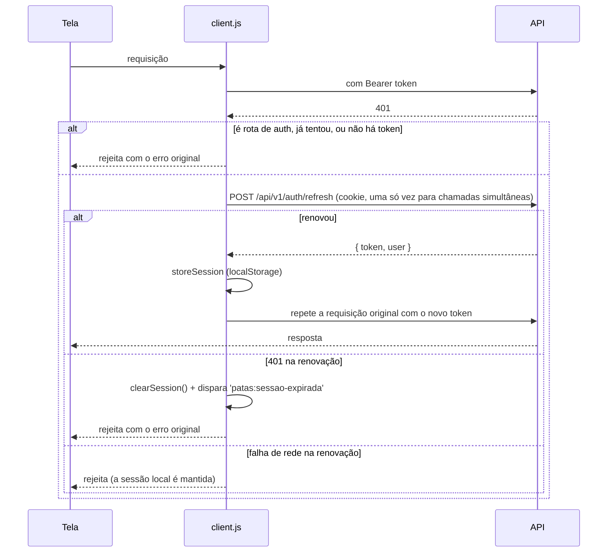

# 7. Comunicação com a API

## Cliente HTTP (`src/api/client.js`)

| Item | Valor |
| --- | --- |
| Biblioteca | Axios (`axios.create`) |
| `baseURL` | `process.env.REACT_APP_API_URL` ou `http://localhost:4000` |
| `withCredentials` | `true` — envia o cookie `patas_refresh` (HttpOnly) às rotas de autenticação |
| Cabeçalhos padrão | `Content-Type: application/json`; `X-Requested-With: XMLHttpRequest` (exigido pela API como proteção CSRF em `/auth/refresh` e `/auth/logout`) |
| Timeout | não configurado (padrão do Axios: sem limite) |
| Exportações | `default api`, `clearSession()`, `SESSION_EXPIRED_EVENT = 'patas:sessao-expirada'` |

### Interceptor de requisição

Lê `patas_admin_token` do `localStorage` e, se a chamada ainda não tiver `Authorization`, adiciona
`Authorization: Bearer <token>`. Vale para **todas** as chamadas, inclusive as públicas, quando há sessão salva.

### Interceptor de resposta (renovação de sessão)

Rotas de autenticação não passam pela renovação: `/api/v1/auth/login`, `/auth/refresh`, `/auth/logout`.

### Tratamento de erros

Não há tratamento central de mensagens: cada tela lê o envelope de erro da API
`error.response.data.error = { code, message, details[] }`:

| Padrão | Onde |
| --- | --- |
| `errorMessage(error, fallback)` → `error.response.data.error.message` ou o texto padrão | `admin/shared/usePaginatedList.js` (usado no painel) |
| `FormError` mostra `message` + lista de `details[].message` | Diálogos do painel |
| Sem `error.response` → "Não foi possível conectar…" | Login, esqueci a senha, formulários públicos |
| Erro por campo (`details[].field`) volta o formulário ao passo do campo | `AdoptionFormModal` |
| Status específico (404, 410, 422, 503, `LINK_INVALIDO`, `MOTIVO_OBRIGATORIO`) muda a tela | Perfil do animal, doação, redefinir senha, status do animal |
| Erro ignorado (seção some ou mostra "—") | `StatsStrip`, `Stories`, `useAdoptionSteps`, resumo de doações, lista de animais adotados no formulário de história |

Respostas de sucesso usam o envelope `{ data, meta }`; os serviços devolvem `response.data.data` (e `meta` nas listas).

## Todas as chamadas

### Site público (`src/api/*.js`)

| Função | Método | Endpoint | Parâmetros | Resposta usada | Onde é usada |
| --- | --- | --- | --- | --- | --- |
| `buscarTodoAnimais({ signal })` | GET | `/api/v1/public/animals` | `page`, `pageSize=100`; repete até `meta.totalPages` | `data[]` de todas as páginas (animais crus) | `useAvailableAnimals` → Home, catálogo |
| `buscarAnimal(id, { signal })` | GET | `/api/v1/public/animals/:id` | `id` (codificado) | `data` (animal com `fotos`, `temperamento`) | `AnimalProfilePage` |
| `buscarNumeros({ signal })` | GET | `/api/v1/public/stats` | — | `{ animais_resgatados, adocoes_realizadas, aguardando_lar }` | `StatsStrip` |
| `buscarHistorias({ signal })` | GET | `/api/v1/public/stories` | `pageSize=6` | `data[]` (`autor_nome`, `texto`, `foto_url`, `animal`) | `Stories` |
| `buscarEtapasAdocao({ signal })` | GET | `/api/v1/public/adoption-steps` | — | `data[]` (`ordem`, `titulo`, `descricao`) | `useAdoptionSteps` |
| `enviarPedidoAdocao(pedido)` | POST | `/api/v1/public/adoption-requests` | `animal_id, nome, email, telefone, cidade, rotina, ambiente_seguro, ciente_pos_adocao, visita_preferida_em?, website` | `{ protocolo, status, data_pedido, animal }` | `AdoptionFormModal` |
| `enviarInscricaoVoluntario(dados)` | POST | `/api/v1/public/volunteers` | `nome, email, telefone, areas[], website` | `{ protocolo, status }` | `VolunteerSignup` |
| `iniciarDoacao(dados)` | POST | `/api/v1/public/donations/checkout` | `valor, nome, email, tipo` | `{ tipo, referencia, checkout_url }` | `DonationPage` |
| `consultarDoacao(ref, { signal })` | GET | `/api/v1/public/donations/status/:ref` | `ref` | `{ tipo, status, valor }` | `DonationReturnPage` |
| `pedirLinkCancelamento(email)` | POST | `/api/v1/public/donations/subscriptions/cancel-link` | `email` | `{ mensagem }` | `CancelSubscriptionPage` |
| `cancelarDoacaoMensal(token)` | POST | `/api/v1/public/donations/subscriptions/cancel` | `token` | `{ status, valor }` | `CancelSubscriptionPage` |

### Autenticação (`src/admin/security/authService.js` e `client.js`)

| Função | Método | Endpoint | Parâmetros | Resposta usada | Onde |
| --- | --- | --- | --- | --- | --- |
| `loginAdmin(email, password)` | POST | `/api/v1/auth/login` | `{ email, password }` | `{ token, user }` (+ `user.role = user.cargo`) | `AdminLoginPage` |
| `fetchAdminMe(token)` | GET | `/api/v1/me` | cabeçalho `Authorization` explícito | usuário + `permissions` (+ `role`) | `AdminDashboardPage` |
| `logoutAdmin()` | POST | `/api/v1/auth/logout` | cookie | — | `AdminDashboardPage` |
| `requestPasswordReset(email)` | POST | `/api/v1/auth/forgot-password` | `{ email }` | `{ mensagem }` | `AdminForgotPasswordPage` |
| `resetPassword(token, novaSenha)` | POST | `/api/v1/auth/reset-password` | `{ token, nova_senha }` | — | `AdminResetPasswordPage` |
| `refreshSession()` (interna) | POST | `/api/v1/auth/refresh` | cookie | `{ token, user }` | Interceptor de resposta |

### Painel (`src/admin/<módulo>/<módulo>Service.js`)

Listas devolvem `{ items: data ?? [], meta: meta ?? {} }`. `params` são os filtros da URL (`page`, `pageSize`, `q`, …).

| Função | Método | Endpoint | Parâmetros | Resposta | Onde |
| --- | --- | --- | --- | --- | --- |
| `fetchDashboardSummary({ fresh })` | GET | `/api/v1/dashboard/summary` | `atualizar=true` se `fresh` | resumo | `DashboardOverview` |
| `listAnimals(params)` | GET | `/api/v1/animals` | filtros, `sort`, `order`, paginação | `{ items, meta }` | `AnimalsPage`, `StoryFormDialog` |
| `getAnimal(id)` | GET | `/api/v1/animals/:id` | — | animal + `fotos` | `AnimalPhotos` |
| `createAnimal(payload)` | POST | `/api/v1/animals` | campos do formulário | animal criado | `AnimalsPage` |
| `updateAnimal(id, payload)` | PUT | `/api/v1/animals/:id` | idem | animal | `AnimalsPage` |
| `updateAnimalStatus(id, status, motivo)` | PATCH | `/api/v1/animals/:id/status` | `{ status, motivo }` | animal | `AnimalsPage` |
| `deleteAnimal(id)` | DELETE | `/api/v1/animals/:id` | — | — | `AnimalsPage` |
| `uploadAnimalPhotos(id, files)` | POST | `/api/v1/animals/:id/photos` | `FormData` com `fotos` (multipart) | animal + `fotos` | `AnimalPhotos` |
| `setMainAnimalPhoto(id, photoId)` | PATCH | `/api/v1/animals/:id/photos/:photoId/principal` | — | animal + `fotos` | `AnimalPhotos` |
| `deleteAnimalPhoto(id, photoId)` | DELETE | `/api/v1/animals/:id/photos/:photoId` | — | animal + `fotos` | `AnimalPhotos` |
| `listAdoptionRequests(params)` | GET | `/api/v1/adoption-requests` | `q`, `status`, `prioridade`, paginação | `{ items, meta }` | `AdoptionsPage` |
| `getAdoptionRequest(id)` | GET | `/api/v1/adoption-requests/:id` | — | pedido completo | `AdoptionDetailDialog` |
| `revealAdoptionRequest(id)` | POST | `/api/v1/adoption-requests/:id/reveal` | — | `{ adotante: { email, telefone }, observacoes }` | `AdoptionDetailDialog` |
| `approveAdoptionRequest(id, decisao)` | POST | `/api/v1/adoption-requests/:id/approve` | `{ justificativa, notificar_adotante, mensagem_adotante }` | pedido + `email` | `AdoptionDetailDialog` |
| `rejectAdoptionRequest(id, decisao)` | POST | `/api/v1/adoption-requests/:id/reject` | idem | pedido + `email` | `AdoptionDetailDialog` |
| `scheduleAdoptionRequest(id, payload)` | POST | `/api/v1/adoption-requests/:id/schedule` | `{ tipo, data_hora, duracao_minutos, local, mensagem, enviar_email }` | `{ pedido, agendamento, email }` | `AdoptionDetailDialog` |
| `rescheduleAppointment(id, aid, payload)` | PATCH | `/api/v1/adoption-requests/:id/appointments/:aid` | `{ data_hora, duracao_minutos, local, mensagem, enviar_email }` | idem | `AdoptionDetailDialog` |
| `cancelAppointment(id, aid, payload)` | POST | `/api/v1/adoption-requests/:id/appointments/:aid/cancel` | `{ motivo, enviar_email }` | idem | `AdoptionDetailDialog` |
| `completeAppointment(id, aid)` | POST | `/api/v1/adoption-requests/:id/appointments/:aid/complete` | — | `{ pedido }` | `AdoptionDetailDialog` |
| `listAdopters(params)` | GET | `/api/v1/adopters` | `q`, `status`, `estado`, paginação | `{ items, meta }` | `AdoptersPage` |
| `getAdopter(id)` | GET | `/api/v1/adopters/:id` | — | adotante + `historico` | `AdopterDetailDialog` |
| `revealAdopter(id)` | POST | `/api/v1/adopters/:id/reveal` | — | `{ email, telefone, endereco }` | `AdopterDetailDialog` |
| `updateAdopter(id, changes)` | PATCH | `/api/v1/adopters/:id` | só campos alterados | adotante | `AdopterDetailDialog` |
| `exportAdoptersCsv(params)` | GET | `/api/v1/adopters/export` | filtros; `responseType: 'blob'` | Blob CSV | `AdoptersPage` |
| `exportAdopterData(id)` | GET | `/api/v1/adopters/:id/lgpd-export` | — | documento JSON | `AdopterDetailDialog` |
| `anonymizeAdopter(id)` | POST | `/api/v1/adopters/:id/anonymize` | `{ confirmacao: 'ANONIMIZAR' }` | — | `AdopterDetailDialog` |
| `deleteAdopter(id)` | DELETE | `/api/v1/adopters/:id` | corpo `{ confirmacao: 'EXCLUIR' }` | — | `AdopterDetailDialog` |
| `listDonations(params)` | GET | `/api/v1/donations` | `q`, `status`, `metodo`, `tipo`, paginação | `{ items, meta }` | `DonationsPage` |
| `fetchDonationSummary()` | GET | `/api/v1/donations/summary` | — | `{ arrecadado_mes_atual, total_confirmado, por_tipo[] }` | `DonationsPage` |
| `createDonation(payload)` | POST | `/api/v1/donations` | campos do formulário | doação | `DonationsPage` |
| `updateDonation(id, changes)` | PATCH | `/api/v1/donations/:id` | idem | doação | `DonationsPage` |
| `listSubscriptions(params)` | GET | `/api/v1/donations/subscriptions` | `page`, `pageSize=10`, `status` | `{ items, meta }` | `SubscriptionsSection` |
| `cancelSubscription(id)` | POST | `/api/v1/donations/subscriptions/:id/cancel` | — | assinatura | `SubscriptionsSection` |
| `listStories(params)` | GET | `/api/v1/stories` | `publicado`, paginação | `{ items, meta }` | `StoriesPage` |
| `createStory(payload)` | POST | `/api/v1/stories` | `{ autor_nome, texto, foto_url, animal_id, publicado }` | história | `StoriesPage` |
| `updateStory(id, changes)` | PATCH | `/api/v1/stories/:id` | idem ou `{ publicado }` | história | `StoriesPage` |
| `deleteStory(id)` | DELETE | `/api/v1/stories/:id` | — | — | `StoriesPage` |
| `listVolunteers(params)` | GET | `/api/v1/volunteers` | `q`, `status`, `area`, paginação | `{ items, meta }` | `VolunteersPage` |
| `createVolunteer(payload)` | POST | `/api/v1/volunteers` | `{ nome, email, telefone, status, data_inicio, areas }` | voluntário | `VolunteersPage` |
| `listTeam(params)` | GET | `/api/v1/users` | `q`, `cargo`, paginação | `{ items, meta }` | `TeamPage` |
| `createTeamMember(payload)` | POST | `/api/v1/users` | `{ nome, email, cargo, ativo, senha }` ou `{ …, enviar_convite: true }` | usuário + `convite` | `TeamPage` |
| `updateTeamMember(id, changes)` | PATCH | `/api/v1/users/:id` | `{ nome, email, cargo, ativo }` | usuário | `TeamPage` |
| `resetTeamMemberPassword(id, novaSenha)` | POST | `/api/v1/users/:id/password` | `{ nova_senha }` | — | `TeamPage` |
| `sendTeamInvite(id)` | POST | `/api/v1/users/:id/invite` | — | `{ enviado, motivo? }` | `TeamPage` |

**Total:** 11 funções públicas + 5 de autenticação + 44 do painel = **60 funções**, mais a renovação interna.

### Rotas da API que o front não chama

`GET /animals/export`, `GET /adoption-requests/board`, `PATCH /adoption-requests/:id`, `POST /adoption-requests/:id/term-signed`,
`GET /donations/monthly`, `GET /donations/export`, `GET /donations/:id`, `GET/PATCH/DELETE /volunteers/:id`,
`GET /stories/:id`, `GET /users/:id`, `GET /permissions`, `PATCH /me/password`. Algumas correspondem a funcionalidades
que a interface sugere mas não oferece (ver [14](14-pontos-de-atencao.md)).

### Download de arquivos

CSV de adotantes (Blob da API) e JSON do titular são baixados por `downloadFile` (`admin/shared/downloadFile.js`).
A agenda do painel é exportada em CSV gerado no próprio navegador (`exportAgenda` em `DashboardOverview`).
