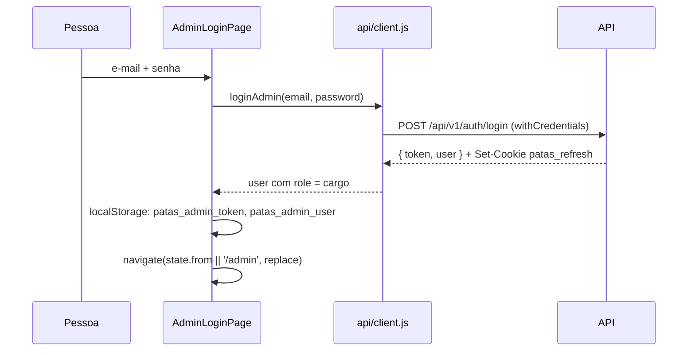

# 8. Autenticação e permissões

Só o **painel** tem login. O site público não tem conta de usuário (favoritos ficam no navegador).

## Onde fica cada credencial

| Credencial | Onde | Quem controla |
| --- | --- | --- |
| Token de acesso (JWT, 15 min na API) | `localStorage['patas_admin_token']` | Front (grava no login e na renovação; envia como `Authorization: Bearer`) |
| Cookie de renovação `patas_refresh` | Cookie `HttpOnly`, `SameSite=Strict`, `Path=/api/v1/auth` | API (o JavaScript do front não consegue ler) |
| Dados do usuário | `localStorage['patas_admin_user']` (gravado, mas não lido) e estado `user` de `AdminDashboardPage` (de `/me`) | Front |

## Login

Erros: sem resposta → "Não foi possível conectar ao servidor…"; com resposta → mensagem da API
(`CREDENCIAIS_INVALIDAS`, `LOGIN_BLOQUEADO`, `MUITAS_REQUISICOES`, validação).

## Abertura do painel e permissões

1. `RequireAdminSession`: sem token salvo → `/admin/login` com `state.from` (página pedida).
2. `AdminDashboardPage` chama `GET /api/v1/me` com o token. 401/404 → `clearSession()` e login.
3. `user.permissions` (lista achatada `modulo:acao` da API) decide:
   - itens do menu (`AdminLayout` filtra `adminNavigationGroups` por `item.permission`);
   - acesso à aba (`section.permission`; sem ela: "Acesso sem permissão");
   - botões em cada tela (`permissions.includes('animals:create')` etc.).

| Aba | Permissão para ver | Permissões que liberam ações |
| --- | --- | --- |
| Visão geral | — | — |
| Animais | `animals:read` | `animals:create`, `animals:update`, `animals:delete` |
| Adoções | `adoptions:read` | `adoptions:update` (agenda), `adoptions:approve` (decisão), `adopters:reveal` (contatos) |
| Adotantes | `adopters:read` | `adopters:reveal`, `adopters:update`, `adopters:export`, `lgpd:approve` |
| Histórias | `stories:read` | `stories:create`, `stories:update`, `stories:delete` |
| Doações | `donations:read` | `donations:create`, `donations:update` |
| Voluntários | `volunteers:read` | `volunteers:create` |
| Equipe e acessos | `team:read` | `team:create`, `team:update` |

O atalho de engrenagem na barra superior aparece só com `team:read`. Rótulos dos cargos (`roleLabels`): Super Admin,
Gestor da ONG, Veterinário / Cuidador, Atendimento e Doações, Voluntário.

**O front só esconde; quem autoriza é a API.** Qualquer chamada sem permissão recebe 403 da API, independentemente do
que a tela mostra.

## Renovação e expiração

- Ao receber 401 numa rota protegida, o interceptor chama `POST /auth/refresh` (uma vez, compartilhada entre chamadas
  simultâneas), grava o novo token e repete a chamada ([7. API](07-api.md#interceptor-de-resposta-renovação-de-sessão)).
- Se a renovação for recusada (401), limpa a sessão e dispara `patas:sessao-expirada`; `AdminDashboardPage` leva ao
  login com o aviso "Sua sessão expirou por inatividade".
- Falha de rede na renovação não desloga.

## Logout

"Sair" (`AdminLayout`) → `AdminDashboardPage.handleLogout`: `POST /auth/logout` (erros ignorados) → `clearSession()` →
`/admin/login`.

## Recuperação de senha e convite

| Tela | Chamada | Resultado |
| --- | --- | --- |
| `/admin/esqueci-senha` | `POST /auth/forgot-password` | Mensagem neutra da API (não revela se o e-mail existe) |
| `/admin/redefinir-senha?token=…` | `POST /auth/reset-password` | Senha definida → login com "Senha definida. Entre com a nova senha." |
| `/admin/redefinir-senha?token=…&convite=1` | idem | Mesmo fluxo, com textos de convite |
| Painel › Equipe › Nova senha | `POST /users/:id/password` | Administrador define a senha |
| Painel › Equipe › Enviar convite | `POST /users/:id/invite` | Link de 72 h, se o servidor tiver SMTP |

A troca da **própria** senha (`PATCH /me/password`) existe na API, mas não há tela para ela.

## Rotas públicas

As rotas do site não exigem autenticação. Ainda assim, se houver token salvo, o interceptor o envia também nas
chamadas públicas (a API ignora).
