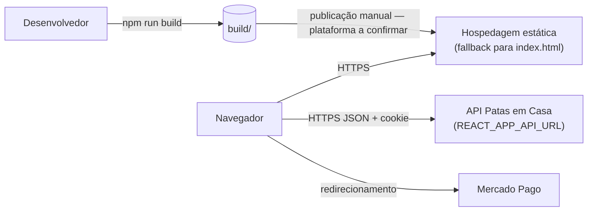

# 13. Build e deploy

## Build

`npm run build` (`react-scripts build`) gera `build/` com:

- `index.html` (a partir de `public/index.html`, com `%PUBLIC_URL%` resolvido);
- JavaScript e CSS minificados com hash no nome; **um chunk separado para o painel** (as 4 páginas `lazy` de `/admin`),
  então quem visita o site não baixa o código administrativo;
- arquivos de `public/` copiados (`favicon.svg`) e `src/assets/fundo.webp` com hash.

O `REACT_APP_API_URL` é embutido **no momento do build**: trocar a API exige gerar o build de novo. Navegadores-alvo do
build de produção (`browserslist`): `>0.2%`, `not dead`, `not op_mini all`.

Com `CI=true`, avisos do ESLint viram erro e interrompem o build.

## Ambientes

| Ambiente | Como roda | API |
| --- | --- | --- |
| Desenvolvimento | `npm start` em `http://localhost:3000` | `REACT_APP_API_URL` do `.env` ou `http://localhost:4000` |
| Testes | Jest (jsdom), serviços mockados | nenhuma |
| Produção | ⚠️ A confirmar | ⚠️ A confirmar |

## CI/CD

**Não há pipeline no repositório do front** (sem `.github/workflows`, Dockerfile ou configuração de hospedagem). O
README sugere, como proposta, `npm ci` → testes → `npm run build` → publicar `build/` em hospedagem estática.

## Implantação

⚠️ A confirmar: o repositório não indica onde o front é publicado. O que o código exige de qualquer hospedagem:

| Requisito | Por quê |
| --- | --- |
| Servir arquivos estáticos de `build/` | É uma SPA sem servidor próprio |
| **Fallback de todas as rotas para `index.html`** | O `BrowserRouter` usa URLs reais (`/adotar`, `/admin/animais`); sem fallback, recarregar ou abrir um link direto dá 404 do servidor |
| HTTPS | O cookie de renovação da API é `Secure` em produção |
| Origem do site em `CORS_ORIGIN` da API e `FRONTEND_URL` apontando para ele | Login/renovação com cookie e links dos e-mails (`/admin/redefinir-senha`, `/doar/retorno`, `/doar/cancelar`) |
| `REACT_APP_API_URL` com a URL pública da API no build | Chamadas HTTP |

