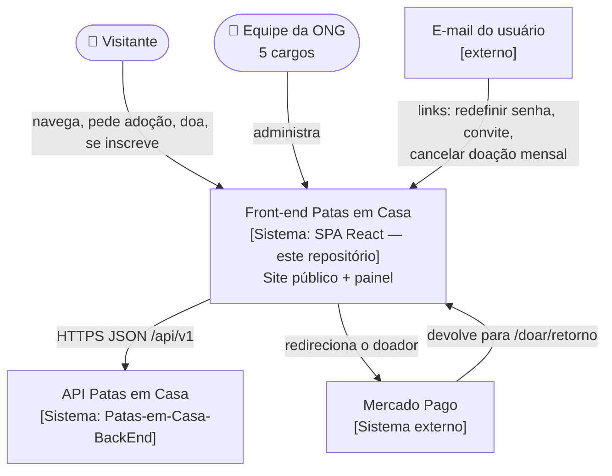
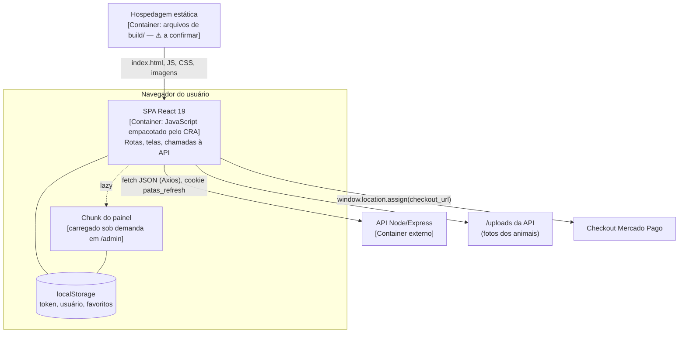
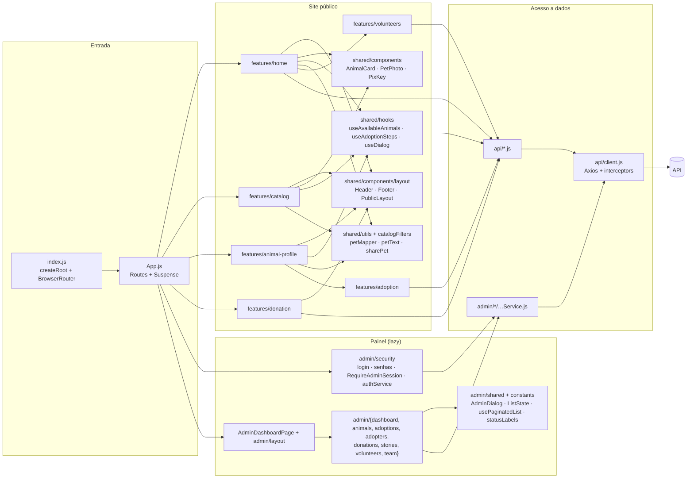
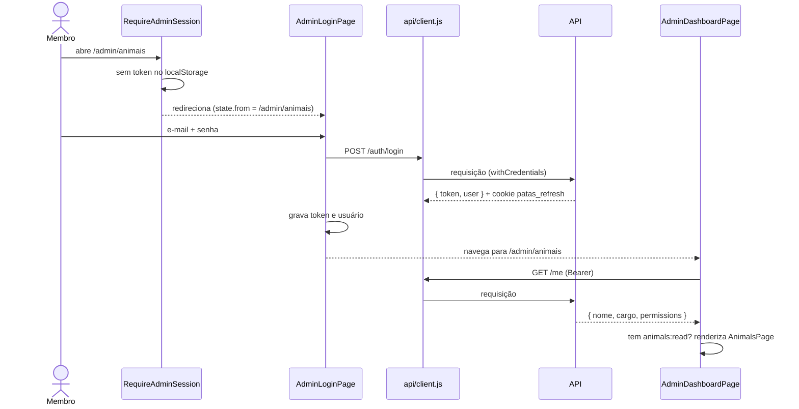
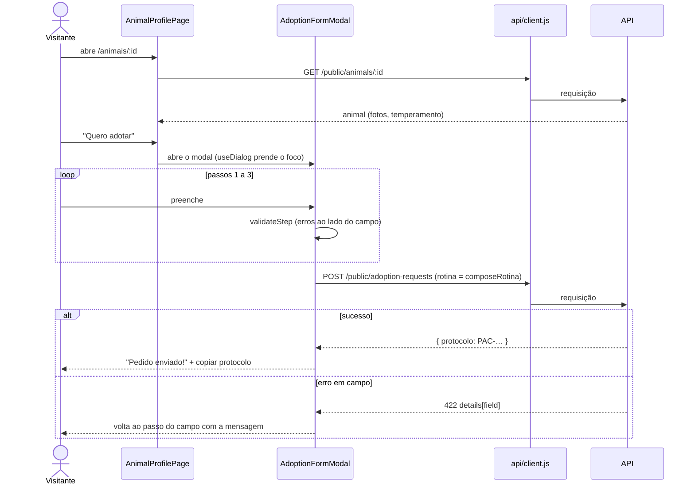
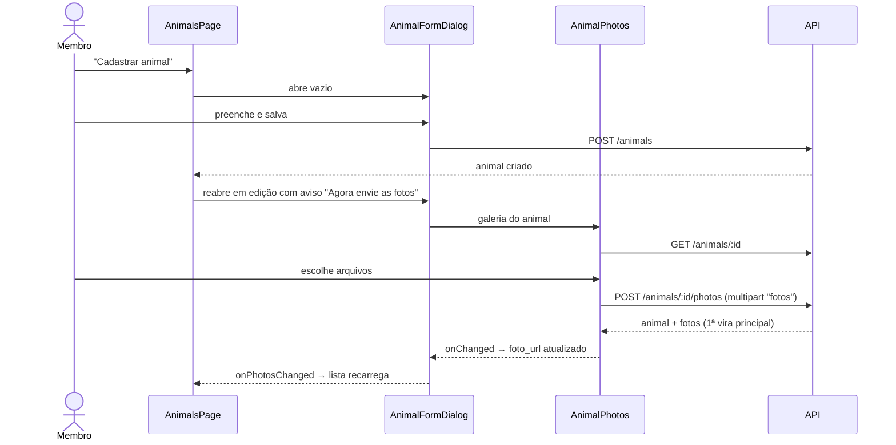
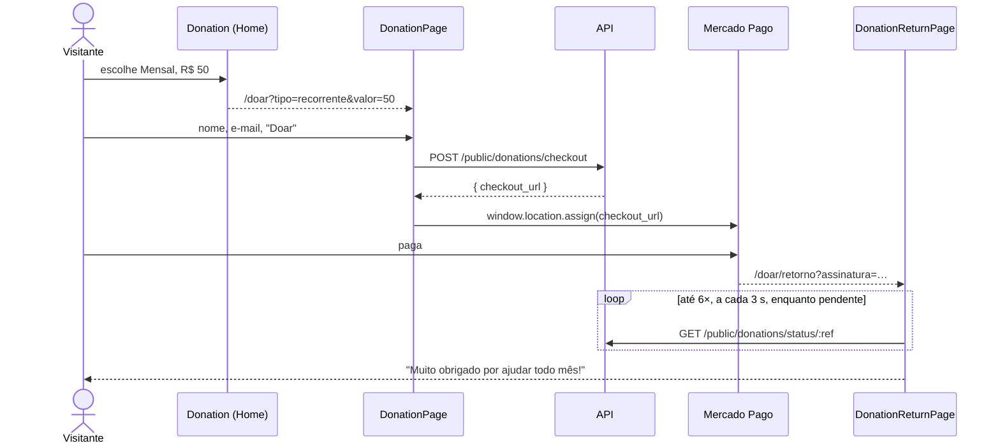
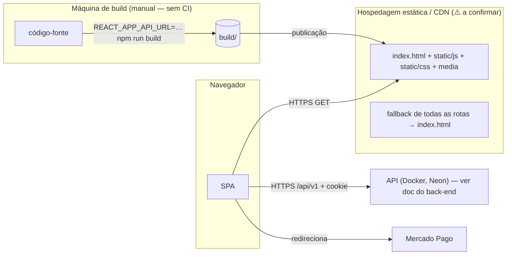

# Documento de arquitetura do front-end

## 1. Objetivo e escopo

Descrever como o front-end Patas em Casa está construído: organização, componentes, comunicação com a API, decisões
e como atende aos requisitos não funcionais. Escopo: o repositório `Patas-em-Casa` (site público + painel). A API, o
banco e as integrações de servidor estão na documentação do back-end; aparecem aqui só como sistemas externos.

## 2. Visão geral e padrão

**Single Page Application em React**, renderizada no navegador (sem SSR), com **organização por funcionalidade**
(*feature-based*) e componentização:

| Camada | Pasta | Papel |
| --- | --- | --- |
| Aplicação | `src/app` | Rotas e composição (`App`), 404 |
| Funcionalidades do site | `src/features/<funcionalidade>` | Página + componentes + regras locais de cada fluxo (home, catálogo, perfil, adoção, doação, voluntários) |
| Painel | `src/admin/<módulo>` | Tela, diálogos e serviço de cada módulo; `admin/shared`, `admin/layout`, `admin/security` |
| Compartilhado | `src/shared` | Componentes, hooks e utils usados por mais de uma funcionalidade do site |
| Acesso a dados | `src/api` (site e cliente HTTP), `src/admin/*/…Service.js` (painel) | Funções que chamam a API e devolvem `data` |
| Estilo | `src/styles`, CSS por componente | Tokens globais e estilos por prefixo |

Não segue *atomic design* (não há átomos/moléculas/organismos), nem camada de estado global. **Justificativa:** a
árvore do `README` descreve "uma pasta por funcionalidade do site público" e `shared/` como "o que mais de uma
funcionalidade usa", e os comentários dos arquivos explicam o "Para quê" de cada parte, mas o motivo da escolha não
está registrado. ⚠️ inferido, confirmar: a organização por funcionalidade foi adotada para que cada fluxo fique num
lugar só.

## 3. C4 — Nível 1: Contexto

## 4. C4 — Nível 2: Containers

## 5. C4 — Nível 3: Componentes do front

## 6. Sequências

### 6.1 Login no painel e abertura

### 6.2 Cadastro: pedido de adoção pelo site

### 6.3 Cadastro de animal com fotos (painel)

### 6.4 Doação online

### 6.5 Renovação de sessão

Ver [7. API › interceptor de resposta](../07-api.md#interceptor-de-resposta-renovação-de-sessão).

## 7. Decisões arquiteturais

"Fonte" indica onde a decisão está registrada. Onde as alternativas não estão registradas no código, elas foram
listadas por esta documentação e marcadas.

| # | Decisão | Contexto | Alternativas | Motivo | Fonte |
| --- | --- | --- | --- | --- | --- |
| AD01 | React com Create React App | Interface com muitos componentes interativos | HTML sem framework, Vite, Next.js (registradas no README) | "setup simples e familiar"; consequência: sem SSR | README, ADR-001 |
| AD02 | Organização por funcionalidade + imports absolutos | O código estava espalhado por tipo de arquivo | Por tipo (components/pages/services); atomic design ⚠️ (não registradas) | Cada fluxo num lugar; `jsconfig.json` com `baseUrl: src` | README (árvore), `jsconfig.json` |
| AD03 | Painel na mesma SPA, carregado sob demanda | Site e painel compartilham build e cliente HTTP | App separado para o painel ⚠️ (não registrada) | "O painel só é baixado por quem abre /admin" | Comentário em `App.js` |
| AD04 | Normalizar o animal na fronteira (`petMapper`) | A API usa códigos (`femea`, `medio`) e nomes diferentes dos da interface | Usar o contrato bruto; schema formal (README) | Componentes mais simples e filtros com valores confiáveis | README ADR-003, comentários do `petMapper` |
| AD05 | Filtrar e ordenar o catálogo no navegador, com estado na URL | Resposta rápida a cada clique; links compartilháveis | Filtro na API, biblioteca de busca, paginação no servidor (README) | Simples para coleções pequenas/médias; Voltar mantém a busca | README ADR-004, comentários do catálogo |
| AD06 | Sem store global: estado local, URL e `localStorage` | Poucos dados compartilhados entre telas | Redux/Context ⚠️ (não registradas) | ⚠️ inferido, confirmar | Ausência no código |
| AD07 | Axios com interceptors; token de acesso no `localStorage`, renovação por cookie HttpOnly | Token de 15 min na API | Token só em memória; cookie para tudo ⚠️ (não registradas) | "a renovação mantém o painel aberto enquanto há uso" | Comentários de `api/client.js` |
| AD08 | Interface por permissões vindas de `/me` | A matriz de permissões vive na API | Permissões fixas no front ⚠️ | Fonte única; "a proteção real está na API" | Comentários de `RequireAdminSession` |
| AD09 | CSS puro por componente com tokens em `:root` | Visual próprio da marca | Tailwind, CSS Modules, styled-components ⚠️ | ⚠️ inferido, confirmar; "centralizar o design system" nos tokens | Comentário em `globals.css` |
| AD10 | Gráficos do painel em CSS/SVG, sem biblioteca | Poucos tipos de gráfico | Chart.js/Recharts ⚠️ | "sem biblioteca, com alternativa em texto para leitores de tela" | Comentário em `DashboardCharts.jsx` |
| AD11 | Diálogos: `<dialog>` nativo no painel; `useDialog` próprio no site | Foco preso, Esc, rolagem | Biblioteca de modais ⚠️ | "showModal() prende o foco e trata o Esc" | Comentários de `AdminDialog`, `useDialog` |
| AD12 | Pagamento fora do site (redirecionamento ao Mercado Pago) | Aceitar Pix, cartão, boleto | Formulário de cartão no site ⚠️ | "sem que dados de pagamento passem pelo site da ONG" | Comentário em `DonationPage.jsx` |
| AD13 | Testes com Testing Library e serviços mockados | Testar telas sem API | Testes de integração/E2E ⚠️ | Testes rápidos e isolados (consequência: contrato com a API não testado) | `*.test.js` |

## 8. Tecnologias e versões

| Tecnologia | Versão instalada | Papel |
| --- | --- | --- |
| React / React DOM | 19.2.8 | UI |
| react-scripts (CRA) | 5.0.1 | Build, dev server, Jest, ESLint |
| React Router DOM | 6.30.0 | Rotas |
| Axios | 1.20.0 | HTTP |
| Framer Motion | 13.1.0 | Animações |
| Lucide React | 1.29.0 | Ícones |
| Testing Library (react/dom/jest-dom) | 16.3.2 / 10.4.1 / 6.9.1 | Testes |
| Node.js / npm (ambiente atual) | 24.20.0 / 11.19.0 | Ferramentas (⚠️ versão exigida não declarada) |
| Google Fonts | — | Fraunces, Inter, IBM Plex Mono (+ Work Sans sem uso) |

## 9. Atendimento aos requisitos não funcionais

| Tema | Como a arquitetura atende | Limite |
| --- | --- | --- |
| **Desempenho** | Painel em chunk separado (AD03); busca com espera de 300 ms e `useMemo`; lotes de 8 cartões; imagens `lazy`; WebP no topo; cancelamento de requisições ao sair da página | Catálogo baixa todos os animais (AD05); fontes por `@import`; sem cache entre páginas; dashboard consulta a cada 60 s |
| **Segurança** | Token curto + renovação por cookie HttpOnly e `X-Requested-With` (AD07); autorização na API (AD08); pagamento fora do site (AD12); React escapa conteúdo; nenhum `dangerouslySetInnerHTML`; contatos mascarados e revelação explícita | Token no `localStorage` exposto a XSS; sem CSP; armadilha anti-robô da doação não enviada |
| **Usabilidade** | Fluxos curtos (adoção em 3 passos), mensagens em português, estados de carregando/erro/vazio, URLs compartilháveis, avisos de resultado (e-mail enviado ou não) | `prompt`/`confirm` nativos em algumas ações; falhas silenciosas na Home |
| **Acessibilidade** | Diálogos com foco preso (AD11), skip link, `aria-*`, alternativa textual dos gráficos (AD10), "reduzir movimento" | Sem verificação automatizada |
| **Compatibilidade / responsividade** | `browserslist` amplo; media queries em todos os CSS; menus móveis; fallbacks de APIs do navegador | Breakpoints sem padrão |
| **Manutenibilidade** | Funcionalidades isoladas, imports absolutos, comentários "O quê/Como/Para quê", 91 testes | Duplicações, sem tipos, README desatualizado |

## 10. Implantação

Requisitos de implantação em [13. Build e deploy](../13-build-deploy.md#implantação).

## 11. Riscos, limitações e melhorias recomendadas

| # | Risco / limitação | Impacto | Melhoria recomendada (não implementada) |
| --- | --- | --- | --- |
| R1 | Dados de contato e CNPJ de exemplo publicados | Alto (credibilidade, doações) | Preencher `organization.js` com os dados reais antes de publicar |
| R2 | Funcionalidades de triagem, termo assinado e gestão de voluntários ausentes no front | Alto (equipe não consegue concluir o fluxo pelo painel) | Telas para `PATCH /adoption-requests/:id`, `term-signed` e `PATCH/DELETE /volunteers/:id` |
| R3 | Token no `localStorage` | Médio (XSS) | Content-Security-Policy na hospedagem; avaliar manter o token só em memória e usar a renovação por cookie ao recarregar |
| R4 | Catálogo carrega todos os animais | Médio quando o cadastro crescer | Filtros e paginação na API |
| R5 | Contrato com a API sem testes | Médio (quebra silenciosa) | Testes dos serviços e do `client.js` (ex.: com MSW) ou testes de contrato com o `openapi.yaml` |
| R6 | Sem CI nem hospedagem documentada | Médio | Pipeline com testes + build; definir hospedagem com fallback SPA |
| R7 | Armadilha anti-robô da doação inativa | Baixo | Enviar `website` em `iniciarDoacao` |
| R8 | Duplicações e ausência de tipos | Baixo (manutenção) | Centralizar sessão, erros, datas e rótulos; PropTypes ou TypeScript; Prettier |
| R9 | README do repositório desatualizado | Baixo | Apontar para `docs/frontend/` |
| R10 | Fuso do navegador × horário de Brasília nos campos de data/hora do painel | Baixo (equipe no Brasil) | Calcular "agora" em `America/Sao_Paulo` |
