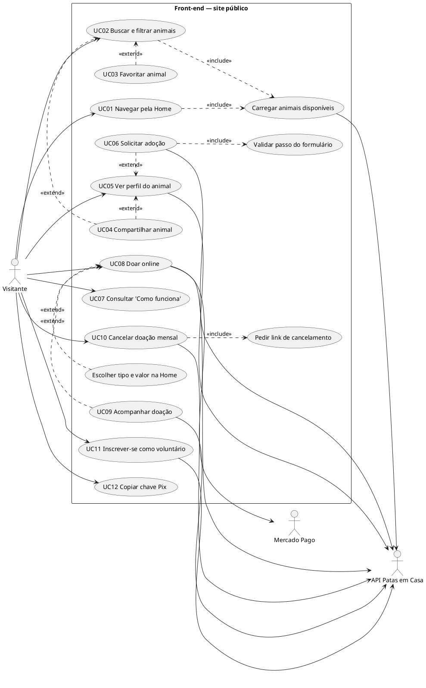
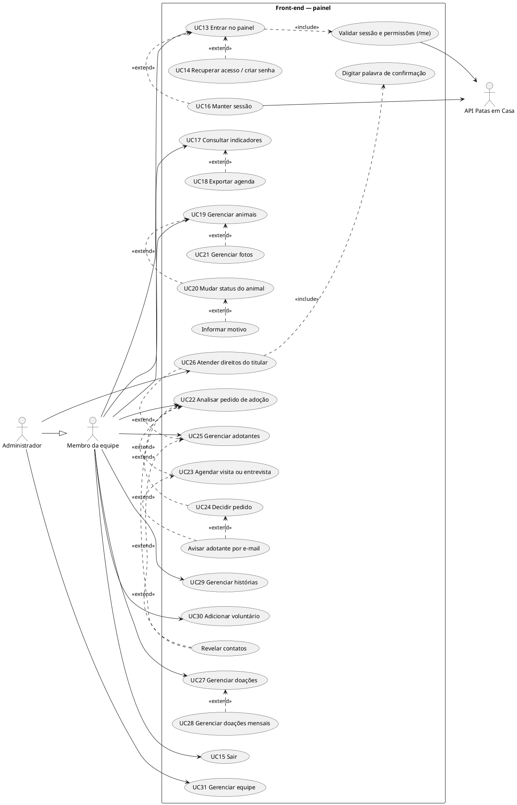

# Casos de uso do front-end

Derivados das telas e fluxos existentes. Requisitos em [requisitos.md](requisitos.md).

## Atores

| Ator | Tipo | Descrição |
| --- | --- | --- |
| Visitante | Humano, primário | Pessoa no site público, sem login |
| Membro da equipe | Humano, primário | Usuário do painel; vê e faz o que o cargo permite (`gestor_ong`, `gestor_animais`, `financeiro`, `voluntariado`) |
| Administrador | Humano, primário | Especialização de Membro com todas as permissões (equipe e LGPD) |
| API Patas em Casa | Sistema, secundário | Fornece dados, autentica e autoriza |
| Mercado Pago | Sistema, secundário | Recebe o doador para o pagamento e o devolve ao site |

## Diagramas

### Site público

### Painel

Todos os casos do painel dependem da sessão validada (UC13) e consultam a API; para não poluir, só as ligações
principais com a API estão desenhadas.

## Especificações

Formato: ator · pré-condições · fluxo principal · fluxos alternativos · exceções · pós-condições.

### UC01 — Navegar pela Home
- **Ator:** Visitante. **Pré-condições:** nenhuma.
- **Principal:** 1. Abre `/`. 2. O sistema mostra o topo com o destaque (primeiro urgente), carrega os animais (*include* "Carregar animais"), números, etapas e histórias. 3. O visitante rola (barra de progresso aparece após 220 px) e escolhe um caminho: catálogo, perfil, "Como funciona", doação ou voluntariado.
- **Alternativos:** a URL tem `#ancora` → a página rola até a seção.
- **Exceções:** API fora → vitrine com mensagem de erro; números "—"; histórias somem; etapas padrão.
- **Pós-condições:** nenhuma alteração de dados.

### UC02 — Buscar e filtrar animais
- **Ator:** Visitante. **Pré-condições:** nenhuma.
- **Principal:** 1. Abre `/adotar`. 2. O sistema carrega todos os disponíveis e mostra 8 cartões (urgentes primeiro). 3. O visitante digita a busca (aplicada após 300 ms), usa filtros rápidos ou a gaveta, e ordena. 4. O sistema atualiza a grade e a URL. 5. Ao rolar, carrega mais 8.
- **Alternativos:** abre com filtros na URL → aplicados de início; remove um chip; "Limpar filtros"; `?pet=<id>` → vai ao perfil.
- **Exceções:** falha da API → "Não conseguimos carregar os animais" + "Tentar novamente"; nenhum resultado → sugestão de limpar.
- **Pós-condições:** URL reflete a busca.

### UC03 — Favoritar animal *(estende UC02)*
- **Principal:** toca o coração → o id vai para o `localStorage` → aviso "foi para os favoritos" → filtro "Meus favoritos (N)" aparece.
- **Alternativos:** desmarcar; outra aba atualiza sozinha.
- **Exceções:** armazenamento bloqueado → favoritos valem só enquanto a página estiver aberta.

### UC04 — Compartilhar animal *(estende UC02 e UC05)*
- **Principal:** toca "Compartilhar" → menu nativo de compartilhamento (Web Share).
- **Alternativos:** sem Web Share → copia o link `/animais/<id>` e avisa.
- **Exceções:** cópia falha → mostra o link para copiar à mão; cancelado → sem aviso.

### UC05 — Ver perfil do animal
- **Ator:** Visitante. **Pré-condições:** id do animal.
- **Principal:** abre `/animais/:id` → galeria, dados, temperamento, saúde, chegada; título da aba com o nome.
- **Exceções:** 410 → "já encontrou um lar" + link ao catálogo; 404/422 → "Não encontramos este animal"; outra falha → "Tentar novamente".

### UC06 — Solicitar adoção *(estende UC05)*
- **Ator:** Visitante, API. **Pré-condições:** perfil carregado.
- **Principal:** 1. "Quero adotar o/a Nome". 2. Passo 1: nome, e-mail, telefone (formatado ao sair), cidade. 3. "Continuar" (*include* validação do passo). 4. Passo 2: moradia, moradores, outros animais, tempo em casa, texto opcional. 5. Passo 3: revisão (com "Editar"), visita sugerida opcional, duas confirmações. 6. "Enviar pedido" → API. 7. Tela "Pedido enviado!" com protocolo e botão "Copiar".
- **Alternativos:** "Voltar" entre passos; fechar com dados → confirmação "Sair sem enviar?".
- **Exceções:** campo inválido → mensagem ao lado e foco no campo; erro da API em campo → volta ao passo do campo; animal indisponível/pedido repetido → mensagem da API; sem conexão → mensagem de conexão.
- **Pós-condições:** pedido `novo` criado na API.

### UC07 — Consultar "Como funciona"
- **Principal:** abre `/como-funciona` → etapas, requisitos, documentos, dúvidas (expansíveis), chamada para os animais e e-mail da equipe.

### UC08 — Doar online
- **Ator:** Visitante, API, Mercado Pago.
- **Principal:** 1. Abre `/doar` (ou vem da Home com tipo e valor — *extend*). 2. Escolhe única/mensal e valor (sugerido ou livre). 3. Informa nome e e-mail. 4. "Doar R$ X" → API cria a cobrança. 5. O navegador vai ao Mercado Pago.
- **Exceções:** valor fora de R$ 5–10.000 → mensagem; 503 → lateral "Doe agora pelo Pix"; outros erros → mensagem e detalhes.
- **Pós-condições:** doação/assinatura `pendente` criada na API.

### UC09 — Acompanhar doação *(estende UC08)*
- **Principal:** o Mercado Pago devolve a `/doar/retorno?ref=…` → consulta → mensagem do status (confirmada, ativa, pendente, falhou, cancelada) e valor.
- **Alternativos:** pendente → nova consulta a cada 3 s, até 6 vezes; falhou → "Tentar de novo".
- **Exceções:** sem referência ou erro → "Não encontramos esta doação".

### UC10 — Cancelar doação mensal
- **Principal (com link):** abre `/doar/cancelar?token=…` → "Sim, cancelar" → "Doação mensal cancelada".
- **Alternativo (sem link):** informa o e-mail (*include* pedir link) → "Confira seu e-mail".
- **Exceções:** link inválido/expirado → mensagem da API.

### UC11 — Inscrever-se como voluntário
- **Principal:** preenche nome, e-mail, telefone e áreas na Home → "Quero ser voluntário" → mensagem com protocolo; formulário limpo.
- **Exceções:** nenhuma área → "Escolha ao menos uma área…"; erro da API → mensagem e detalhes.
- **Pós-condições:** voluntário inativo (em triagem) na API.

### UC12 — Copiar chave Pix
- **Principal:** "Copiar" → chave na área de transferência → "Copiada" por 2 s. **Exceção:** falha silenciosa (o texto continua visível).

### UC13 — Entrar no painel
- **Ator:** Membro. **Pré-condições:** conta ativa.
- **Principal:** 1. Abre `/admin/login` (ou é redirecionado de uma página do painel). 2. E-mail e senha. 3. API valida; token salvo. 4. Volta à página pedida. 5. *Include* `/me`: menu e telas conforme as permissões.
- **Alternativos:** já com token → vai direto a `/admin`; aviso de sessão expirada ou de senha definida.
- **Exceções:** credenciais erradas/bloqueio → mensagem da API; sem conexão → mensagem de conexão; `/me` 401/404 → limpa e volta ao login; aba sem permissão → "Acesso sem permissão".

### UC14 — Recuperar acesso / criar senha *(estende UC13)*
- **Principal:** "Esqueci minha senha" → e-mail → mensagem neutra. Pelo link do e-mail: nova senha + confirmação → login com "Senha definida". Com `convite=1`, os textos são de criação de senha.
- **Exceções:** senhas diferentes; política de senha (detalhes da API); link inválido → "Pedir um novo link"; link sem token → "Link incompleto".

### UC15 — Sair
- **Principal:** "Sair" → API encerra a sessão → limpeza local → login. **Exceção:** API não responde → sai do mesmo jeito.

### UC16 — Manter sessão *(estende UC13; iniciado pelo sistema)*
- **Principal:** uma chamada recebe 401 → renova pelo cookie → repete a chamada; o membro não percebe.
- **Exceções:** renovação recusada → login com "Sua sessão expirou por inatividade"; falha de rede → erro na tela, sessão mantida.

### UC17 — Consultar indicadores
- **Principal:** `/admin` → cartões, gráficos, listas e agenda; atualização automática a cada 60 s e botão "Atualizar".
- **Alternativos:** buscar animal → vai a Animais filtrado; trocar fonte/período do gráfico; filtrar a agenda.
- **Exceções:** falha → "Não foi possível carregar" + "Tentar novamente".

### UC18 — Exportar agenda *(estende UC17)*
- **Principal:** "Exportar" → CSV `agenda-AAAA-MM-DD.csv` com a agenda filtrada.

### UC19 — Gerenciar animais
- **Ator:** Membro (`animals:*`).
- **Principal:** listar/filtrar/ordenar; "Cadastrar animal" → formulário → salvo → o formulário continua aberto para fotos; "Editar" → salvar; excluir com confirmação.
- **Exceções:** erros da API (ex.: animal com pedido não pode ser excluído) em alerta.

### UC20 — Mudar status do animal *(estende UC19)*
- **Principal:** escolhe o novo status na tabela → API aplica. **Extensão:** API exige motivo → `prompt` pede o motivo → nova tentativa.
- **Exceções:** transição inválida ou só para administrador → mensagem da API.

### UC21 — Gerenciar fotos *(estende UC19)*
- **Principal:** na edição, "Enviar fotos" (várias) → galeria atualizada; estrela → principal; lixeira → remove (sem confirmação).
- **Exceções:** tipo/tamanho/limite → mensagem da API.

### UC22 — Analisar pedido de adoção
- **Ator:** Membro (`adoptions:read`).
- **Principal:** lista com filtros → "Detalhes" → dados mascarados, animal, agenda, respostas e histórico.
- **Extensão:** "Mostrar contatos completos" (`adopters:reveal`) → contatos e histórico sem máscara (auditado pela API).
- **Exceções:** falha ao carregar → nova tentativa.

### UC23 — Agendar visita ou entrevista *(estende UC22)*
- **Principal:** "Agendar…" → tipo, data/hora, duração, local, mensagem, e-mail → salvo → aviso se o e-mail foi enviado.
- **Alternativos:** remarcar, cancelar (motivo) ou marcar como realizada.
- **Exceções:** conflito de horário, data passada → mensagem da API; e-mail não enviado → aviso amarelo com o motivo.

### UC24 — Decidir pedido *(estende UC22)*
- **Principal:** "Aprovar" ou "Recusar" → justificativa interna, aviso e mensagem opcional → confirmar → pedido decidido; lista atualizada.
- **Exceções:** justificativa curta; animal já adotado/inativo → mensagem da API.

### UC25 — Gerenciar adotantes
- **Principal:** lista mascarada com filtros; "Exportar CSV" (`adopters:export`); "Ficha" → histórico; "Mostrar contatos"; "Editar cadastro" (só o que mudou).
- **Exceções:** e-mail em uso etc. → mensagem da API.

### UC26 — Atender direitos do titular *(estende UC25)*
- **Ator:** Administrador (`lgpd:approve`).
- **Principal:** "Exportar dados do titular" (JSON) ou "Anonimizar"/"Excluir" → digitar a palavra (*include*) → confirmar.
- **Exceções:** pedidos em andamento → mensagem da API.
- **Pós-condições:** dados anonimizados (ficha recarregada) ou titular excluído (ficha fecha).

### UC27 — Gerenciar doações
- **Principal:** resumo, lista com filtros; "Registrar doação" → formulário → salvo; editar doação manual não cancelada.
- **Alternativos:** doação online mostra "Online (Mercado Pago)" sem edição.

### UC28 — Gerenciar doações mensais *(estende UC27)*
- **Principal:** lista paginada com filtro de situação; "Cancelar" → confirmação → API cancela no Mercado Pago.

### UC29 — Gerenciar histórias
- **Principal:** lista com filtro publicada/rascunho; criar/editar (vínculo opcional a animal adotado); publicar/despublicar; excluir com confirmação.

### UC30 — Adicionar voluntário
- **Principal:** lista com filtros; "Adicionar voluntário" → formulário → salvo. (Editar/ativar/excluir não existem no front.)

### UC31 — Gerenciar equipe
- **Ator:** Administrador (`team:*`).
- **Principal:** lista com filtros; "Adicionar membro" com convite (padrão) ou senha inicial (com "Gerar senha"); editar nome, e-mail, cargo e acesso; "Nova senha"; "Enviar convite".
- **Exceções:** política de senha, e-mail em uso, último administrador, alteração do próprio cargo → mensagens da API; convite não enviado (sem SMTP) → aviso para usar "Nova senha".
