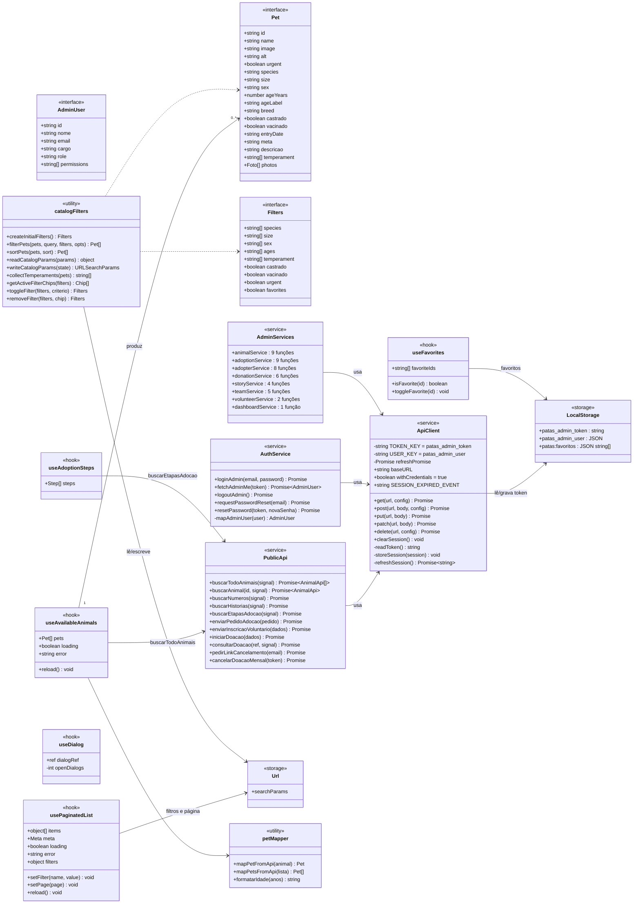

# Diagrama de classes do front-end

**Como ler.** O front é JavaScript com **componentes de função** e hooks: não há classes ES nem herança no código.
Os diagramas representam cada componente, hook, serviço e tipo como uma "classe":

| Elemento | Representação |
| --- | --- |
| Componente React | classe com as **props** como atributos (`+` = prop pública) e o **estado** como atributos privados (`-`); métodos = handlers internos |
| Hook | classe `<<hook>>`; métodos/atributos = o que ele devolve |
| Serviço de API | classe `<<service>>` com as funções exportadas (`+`) |
| Tipo de dado | `<<interface>>` |
| Armazenamento | `<<storage>>` |
| Composição `*--` | o componente pai renderiza o filho como parte de si (o filho não existe sem ele) |
| Agregação `o--` | o pai renderiza uma coleção de itens que existem independentemente (ex.: cartões de animais) |
| Associação `-->` | usa/chama |
| Realização `..|>` | segue o mesmo contrato de props (não há herança real) |

Modelos de dados detalhados em [modelo-dados.md](modelo-dados.md).

## 1. Dados, serviços e estado

## 2. Site público

```mermaid
classDiagram
  direction TB

  class App {
    -string[] ADMIN_TABS
  }
  class PublicLayout {
    +node children
    +string className = ''
  }
  class Header {
    -boolean isOpen
    -boolean scrolled
  }
  class Footer
  class LandingPage {
    -number scrollProgress
    -boolean showProgressBar
  }
  class Hero {
    +Pet[] pets = []
    +pickHighlight(pets)$ Pet
  }
  class StatsStrip {
    -object numeros
    +anosDeAtuacao(hoje)$ number
  }
  class PetSection {
    +Pet[] pets = []
    +boolean loading = false
    +string error = null
    +pickShowcase(pets, size)$ Pet[]
  }
  class HowItWorks {
    +Step[] steps
  }
  class Donation {
    -string tipo = recorrente
    -number valor = 50
    +donationPath(tipo, valor)$ string
  }
  class Stories {
    -Story[] stories
  }
  class VolunteerSignup {
    -object form
    -boolean sending
    -object error
    -object sent
    -handleSubmit(event)
  }
  class AdoptionCatalog {
    -string inputQuery
    -number visibleCount = 8
    -boolean drawerOpen
    -string notice
    -handleShare(pet)
    -handleFavorite(pet)
    -updateCatalog(changes)
  }
  class FilterDrawer {
    +Filters filters
    +setFilters(next)
    +onClose()
    +onClear()
    +number resultCount
    +string[] temperamentOptions = []
  }
  class FilterGroup {
    +string label
    +node children
  }
  class AnimalCard {
    +Pet pet
    +number headingLevel = 3
    +boolean isFavorite = false
    +onToggleFavorite(pet)
    +onShare(pet)
  }
  class PetPhoto {
    +Pet pet
    +string layoutId
    +object style
    +string loading
    -boolean failed
  }
  class AnimalProfilePage {
    -object state
    -boolean formOpen
    -string shareMessage
  }
  class AdoptionFormModal {
    +Pet pet
    +onClose()
    -object form
    -number step
    -object errors
    -object pedido
    -handleSubmit(event)
    +formatPhone(valor)$ string
    +composeRotina(form)$ string
    +validateStep(step, form)$ object
  }
  class HowAdoptionWorksPage
  class DonationPage {
    -string tipo
    -number choice
    -string custom
    -handleSubmit(event)
  }
  class DonationReturnPage {
    -object state
  }
  class CancelSubscriptionPage {
    -object state
    -confirmCancel()
    -requestLink(event)
  }
  class PixKey {
    +string variant = card
    -boolean copied
  }
  class NotFoundPage

  App *-- LandingPage
  App *-- AdoptionCatalog
  App *-- AnimalProfilePage
  App *-- HowAdoptionWorksPage
  App *-- DonationPage
  App *-- DonationReturnPage
  App *-- CancelSubscriptionPage
  App *-- NotFoundPage
  LandingPage *-- Header
  LandingPage *-- Hero
  LandingPage *-- StatsStrip
  LandingPage *-- PetSection
  LandingPage *-- HowItWorks
  LandingPage *-- Donation
  LandingPage *-- Stories
  LandingPage *-- VolunteerSignup
  LandingPage *-- Footer
  PublicLayout *-- Header
  PublicLayout *-- Footer
  AdoptionCatalog *-- PublicLayout
  AnimalProfilePage *-- PublicLayout
  DonationPage *-- PublicLayout
  PetSection "1" o-- "0..4" AnimalCard
  AdoptionCatalog "1" o-- "0..*" AnimalCard
  AdoptionCatalog "1" *-- "0..1" FilterDrawer
  FilterDrawer "1" *-- "6..7" FilterGroup
  AnimalCard *-- PetPhoto
  Stories "1" *-- "1..3" PetPhoto
  AnimalProfilePage "1" *-- "0..1" AdoptionFormModal
  Donation *-- PixKey
  DonationPage *-- PixKey
  AdoptionCatalog --> useAvailableAnimals
  AdoptionCatalog --> useFavorites
  LandingPage --> useAvailableAnimals
  FilterDrawer --> useDialog
  AdoptionFormModal --> useDialog
```

`CancelSubscriptionPage`, `DonationReturnPage`, `HowAdoptionWorksPage` e `NotFoundPage` também são compostas com
`PublicLayout` (ligações omitidas). Componentes internos (`NavItem`, `FooterLink`, `HighlightThumb`, `CountUp`,
`StoryAuthor`, `Gallery`, `PetThumb`, `FieldError`) são partes (`*--`) do arquivo onde estão — ver
[5. Componentes](../05-componentes/README.md).

## 3. Painel

```mermaid
classDiagram
  direction TB

  class SecaoDoPainel {
    <<interface>>
    +AdminUser user
  }
  class RequireAdminSession {
    -readToken() string
  }
  class AdminDashboardPage {
    +string activeTab = dashboard
    -AdminUser user
    -string error
    -boolean loading
    -handleLogout()
  }
  class AdminLayout {
    +AdminUser user
    +string activeTab
    +onLogout()
    +node children
    -boolean collapsed
    -boolean mobileOpen
    -string search
  }
  class AdminDialog {
    +string id
    +string eyebrow
    +string title
    +onClose()
    +boolean wide = false
  }
  class ListState {
    +boolean loading
    +string error
    +boolean empty
    +onRetry()
  }
  class Pagination {
    +Meta meta
    +onChange(page)
  }
  class SearchField {
    +string value
    +onSearch(texto)
    +string label
    -string draft
  }
  class FormError {
    +Error error
    +string fallback
  }
  class DashboardOverview {
    -object summary
    -string monthlySource
    -string agendaType
  }
  class AnimalsPage
  class AdoptionsPage
  class AdoptersPage
  class DonationsPage
  class StoriesPage
  class VolunteersPage
  class TeamPage
  class AnimalFormDialog {
    +object animal
    +onSubmit(payload)
    +onClose()
  }
  class AnimalPhotos {
    +string animalId
    +onChanged(animal)
    -Foto[] photos
  }
  class AdoptionDetailDialog {
    +string requestId
    +AdminUser user
    +onClose()
    +onChanged()
    -object mode
  }
  class AdopterDetailDialog {
    +string adopterId
    +AdminUser user
    -object contacts
    -string mode
  }
  class DonationFormDialog
  class SubscriptionsSection {
    +boolean canCancel
  }
  class StoryFormDialog
  class VolunteerFormDialog
  class TeamMemberDialog
  class ResetPasswordDialog
  class PasswordField {
    +string id
    +string value
    +onChange(senha)
  }

  AnimalsPage ..|> SecaoDoPainel
  AdoptionsPage ..|> SecaoDoPainel
  AdoptersPage ..|> SecaoDoPainel
  DonationsPage ..|> SecaoDoPainel
  StoriesPage ..|> SecaoDoPainel
  VolunteersPage ..|> SecaoDoPainel
  TeamPage ..|> SecaoDoPainel

  RequireAdminSession "1" --> "1" AdminDashboardPage : libera
  AdminDashboardPage *-- AdminLayout
  AdminDashboardPage "1" *-- "1" SecaoDoPainel : conforme activeTab
  AdminDashboardPage *-- DashboardOverview
  AnimalsPage "1" *-- "0..1" AnimalFormDialog
  AnimalFormDialog "1" *-- "0..1" AnimalPhotos
  AdoptionsPage "1" *-- "0..1" AdoptionDetailDialog
  AdoptersPage "1" *-- "0..1" AdopterDetailDialog
  DonationsPage "1" *-- "0..1" DonationFormDialog
  DonationsPage *-- SubscriptionsSection
  StoriesPage "1" *-- "0..1" StoryFormDialog
  VolunteersPage "1" *-- "0..1" VolunteerFormDialog
  TeamPage "1" *-- "0..1" TeamMemberDialog
  TeamPage "1" *-- "0..1" ResetPasswordDialog
  TeamMemberDialog *-- PasswordField
  ResetPasswordDialog *-- PasswordField
  AnimalFormDialog *-- AdminDialog
  AdoptionDetailDialog *-- AdminDialog
  AdopterDetailDialog *-- AdminDialog
  DonationFormDialog *-- AdminDialog
  StoryFormDialog *-- AdminDialog
  VolunteerFormDialog *-- AdminDialog
  TeamMemberDialog *-- AdminDialog
  ResetPasswordDialog *-- AdminDialog
  AdoptionsPage *-- Pagination
  AdoptionsPage *-- SearchField
  AdoptionsPage *-- ListState
  AdoptionDetailDialog *-- FormError
  AdoptionsPage --> usePaginatedList
  AdminDashboardPage --> AuthService
  AdminDashboardPage --> AdminUser
```

`Pagination`, `SearchField`, `ListState` e `FormError` também compõem as outras telas e diálogos (lista completa em
[5. Componentes › painel-base](../05-componentes/painel-base.md)). Os 7 componentes internos de
`AdoptionDetailDialog` e os 2 de `AdopterDetailDialog` são partes desses diálogos.
