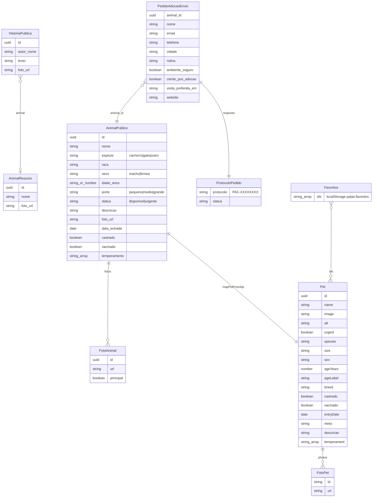
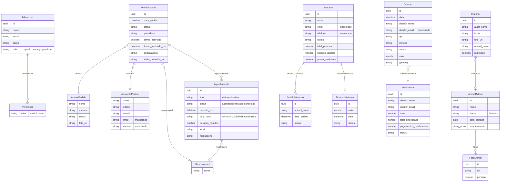

# Modelo de dados do front-end

O front não tem banco. Os dados são (1) **respostas da API** — aqui só os campos que o front lê ou envia, com tipos
inferidos do uso; o contrato completo está no `docs/openapi.yaml` do back-end; (2) **modelos da interface**
criados no front (`Pet`, `Filters`); (3) **armazenamento local** (`localStorage`).

Envelope de todas as respostas: sucesso `{ data, meta? }`; erro `{ error: { code, message, details: [{ field, message }] } }`.
`meta` das listas: `{ page, pageSize, total, totalPages }`.

## Diagrama — site público

## Diagrama — painel

`Voluntario`, `MembroEquipe`, `ResumoDoacoes` e `ResumoDashboard` estão no dicionário abaixo (sem relacionamentos).

## Dicionário de dados

"Obrig." indica se o front **depende** do campo (✓) ou trata a ausência (—). "Padrão" é o valor que o front usa quando
o campo falta ou o valor inicial no formulário.

### `Pet` (modelo da interface)

Criado por `mapPetFromApi` (`src/shared/utils/petMapper.js`) a partir de `AnimalPublico`.

| Campo | Tipo | Obrig. | Padrão | Descrição |
| --- | --- | :---: | --- | --- |
| `id` | string (UUID) \| null | — | `null` | Id da API; usado no link do perfil e nos favoritos |
| `code` | string | — | `'N/A'` | 8 primeiros caracteres do id em maiúsculas. ⚠️ Não exibido |
| `name` | string | — | `'Sem nome'` | Nome |
| `image` | string | — | `''` | `foto_url` (vazio → placeholder) |
| `alt` | string | ✓ | — | "Nome, espécie da raça X" |
| `stamp` | string | — | — | Igual à raça. ⚠️ Não exibido |
| `urgent` | boolean | ✓ | `false` | `status === 'urgente'` |
| `species` | `'Cachorro' \| 'Gato' \| 'Outro'` | ✓ | `'Outro'` | Rótulo da espécie |
| `size` | `'Pequeno' \| 'Médio' \| 'Grande'` \| null | — | `null` | Porte |
| `sex` | `'Macho' \| 'Fêmea'` \| null | — | `null` | Sexo (concordância de textos) |
| `ageYears` | number \| null | — | `null` | Idade em anos (aceita texto numérico da API) |
| `ageLabel` | string | — | `''` | "6 meses", "1 ano e 6 meses" |
| `breed` | string | ✓ | `'SRD'` | Raça |
| `castrado`, `vacinado` | boolean | ✓ | `false` | Cuidados |
| `entryDate` | string `AAAA-MM-DD` \| null | — | `null` | Data de entrada (só a parte da data) |
| `meta` | string | ✓ | — | "Espécie • Raça • Idade • Porte x" (usado na busca) |
| `tags` | string[] | — | sexo + cuidados | ⚠️ Não exibido |
| `descricao` | string | ✓ | `''` | Descrição |
| `temperament` | string[] | ✓ | `[]` | Traços |
| `photos` | `{ id, url }[]` | ✓ | `[]` | Galeria (ou `[{ id: 'principal', url: foto_url }]`) |

### `Filters` (estado do catálogo)

| Campo | Tipo | Padrão | Na URL | Descrição |
| --- | --- | --- | --- | --- |
| `species` | string[] (rótulos) | `[]` | `especie=cachorro,gato` | Espécies |
| `size` | string[] | `[]` | `porte=pequeno` | Portes |
| `sex` | string[] | `[]` | `sexo=femea` | Sexos |
| `ages` | `('filhote'\|'jovem'\|'adulto'\|'idoso')[]` | `[]` | `idade=filhote` | Faixas |
| `temperament` | string[] | `[]` | `temperamento=Calmo,Dócil` (máx. 10) | Traços (todos exigidos) |
| `castrado`, `vacinado`, `urgent`, `favorites` | boolean | `false` | `castrado=1`, `vacinado=1`, `urgente=1`, `favoritos=1` | Interruptores |
| (busca) `query` | string | `''` | `q=` | Texto |
| (ordem) `sort` | `'urgent'\|'waiting'\|'recent'\|'name'` | `'urgent'` | `ordem=espera\|recentes\|nome` | Ordenação |

### Respostas do site público

| Entidade | Campo | Tipo | Obrig. | Descrição |
| --- | --- | --- | :---: | --- |
| `AnimalPublico` | `id`, `nome`, `especie`, `raca`, `sexo`, `idade_anos`, `porte`, `status`, `descricao`, `foto_url`, `data_entrada`, `castrado`, `vacinado`, `temperamento` | ver diagrama | — | Tudo tratado com padrão pelo `petMapper` |
| | `fotos` | `{ id, url, principal }[]` | — | Só no perfil (`/public/animals/:id`) |
| `Números` (`/public/stats`) | `animais_resgatados`, `adocoes_realizadas`, `aguardando_lar` | number | — | Ausente → "—" |
| `Etapa` (`/public/adoption-steps`) | `titulo`, `descricao` | string | ✓ | Viram `{ title, description }` |
| `HistoriaPublica` (`/public/stories`) | `id`, `autor_nome`, `texto`, `foto_url` | string | ✓ (`texto`, `autor_nome`) | — |
| | `animal` | `{ id, nome, especie, foto_url }` \| null | — | Foto alternativa e "adotou Nome" |
| `ProtocoloPedido` | `protocolo` | string `PAC-…` | ✓ | Exibido e copiável |
| `ProtocoloVoluntario` | `protocolo` | string `VOL-…` | — | Exibido se vier |
| `Checkout` | `checkout_url` | string (URL) | ✓ | Redirecionamento |
| | `referencia`, `tipo` | string | — | Não usados pela tela |
| `StatusDoacao` | `status` | `'pendente'\|'confirmada'\|'ativa'\|'falhou'\|'cancelada'` | ✓ | Mensagem; `pendente` repete a consulta |
| | `valor`, `tipo` | number, string | — | "Valor: R$ X (por mês)" |
| `Cancelamento` | `valor` | number | — | "Não haverá novas cobranças de R$ X" |
| `Mensagem` (link de cancelamento, esqueci a senha) | `mensagem` | string | ✓ | Texto neutro exibido |

### Envios do site público

| Envio | Campo | Tipo | Obrig. | Padrão | Descrição |
| --- | --- | --- | :---: | --- | --- |
| `PedidoAdocaoEnvio` | `animal_id` | UUID | ✓ | — | `pet.id` |
| | `nome`, `email`, `telefone`, `cidade` | string | ✓ | `''` | Passo 1 (com `trim`) |
| | `rotina` | string | ✓ | — | `composeRotina` (até ≈ 2000) |
| | `ambiente_seguro`, `ciente_pos_adocao` | boolean | ✓ | `false` | Confirmações |
| | `visita_preferida_em` | string `AAAA-MM-DDTHH:mm` | — | omitido se vazio | Sugestão de visita |
| | `website` | string | ✓ | `''` | Armadilha anti-robô |
| `InscricaoVoluntario` | `nome`, `email`, `telefone` | string | ✓ | — | — |
| | `areas` | string[] | ✓ | — | 1+ das 9 áreas |
| | `website` | string | ✓ | `''` | Armadilha |
| `DoacaoCheckout` | `valor` | number (2 casas) | ✓ | 50 | R$ 5–10.000 |
| | `nome`, `email` | string | ✓ | — | Doador |
| | `tipo` | `'unica'\|'recorrente'` | ✓ | `'unica'` (`/doar`) | — |

### Painel

| Entidade | Campo | Tipo | Obrig. | Descrição |
| --- | --- | --- | :---: | --- |
| `AdminUser` (`/me`, login) | `id`, `nome`, `email`, `cargo` | string | ✓ | `nome` no topo; inicial no avatar |
| | `role` | string | — | Criado pelo front: `user.role \|\| user.cargo` |
| | `permissions` | string[] (`modulo:acao`) | ✓ | Decide menu, abas e botões |
| `AnimalAdmin` | campos do formulário (ver [11](../11-formularios.md#animal-animalformdialog)) + `fotos[]` | — | — | Lista e edição |
| `PedidoAdocao` (lista) | `id`, `data_pedido`, `status`, `prioridade`, `termo_assinado`, `animal{nome, especie}`, `adotante{nome, cidade, estado, email}`, `responsavel{nome}` | — | ✓ (`animal`, `adotante`) | Tabela |
| `PedidoAdocao` (detalhe) | + `termo_assinado_em`, `observacoes`, `visita_preferida_em`, `animal{status, foto_url}`, `adotante{telefone}`, `agendamentos[]` | — | — | Diálogo |
| | `email` (após aprovar/recusar) | `{ enviado, para?, motivo? }` \| null | — | Aviso sobre o e-mail ao adotante |
| `Agendamento` | `id`, `tipo`, `status`, `previsto_em`, `data_hora`, `duracao_minutos`, `local`, `mensagem`, `responsavel{nome}` | — | ✓ (`id`, `tipo`, `status`) | Agenda do pedido |
| `Adotante` (lista) | `id`, `nome`, `cidade`, `estado`, `email`, `telefone`, `total_pedidos`, `pedidos_abertos`, `status`, `criado_em` | — | — | Contatos mascarados |
| `Adotante` (ficha) | + `possui_endereco`, `historico{ pedidos[], doacoes[], historias[] }` | — | — | Ficha |
| `ContatosRevelados` | `email`, `telefone`, `endereco` | string | — | Após "Mostrar contatos" |
| `Doacao` | `id`, `data`, `doador_nome`, `doador_email`, `tipo`, `metodo`, `status`, `valor`, `gateway` | — | ✓ (`id`, `status`, `valor`) | `gateway` preenchido = online |
| `ResumoDoacoes` | `arrecadado_mes_atual`, `total_confirmado`, `por_tipo[{ chave, total, quantidade }]` | — | ✓ | Cartões |
| `Assinatura` | `id`, `doador_nome`, `doador_email`, `valor`, `total_arrecadado`, `pagamentos_confirmados`, `status`, `criado_em` | — | ✓ | Doações mensais |
| `Historia` | `id`, `autor_nome`, `texto`, `foto_url`, `animal_id`, `animal_nome`, `publicado`, `criado_em` | — | ✓ (`texto`, `autor_nome`) | Lista e formulário |
| `Voluntario` | `id`, `nome`, `email`, `telefone`, `areas[]`, `status`, `data_inicio` | — | ✓ (`areas`) | Lista |
| `MembroEquipe` | `id`, `nome`, `email`, `cargo`, `ativo`, `criado_em`; `convite{ enviado, motivo? }` na criação | — | ✓ | Lista e avisos |
| `ResumoDashboard` | `atualizado_em`; `indicadores{ adocoes_mes, adocoes_ano, total_adocoes, arrecadado_mes, pedidos_pendentes, animais_sob_cuidado, total_animais }`; `animais{ por_status[], saude{ total, vacinados, castrados, adotados, percentual_* }, urgentes[] }`; `pedidos{ por_status[], recentes[] }`; `doacoes{ por_metodo[] }`; `series_mensais[{ mes, doacoes_total, doacoes_quantidade, adocoes }]`; `agenda[{ id, tipo, pedido_id, referencia_em, animal_nome, adotante_nome, responsavel_nome }]` | — | ✓ | Visão geral |

### Armazenamento local (`localStorage`)

| Chave | Tipo | Obrig. | Padrão | Descrição |
| --- | --- | :---: | --- | --- |
| `patas_admin_token` | string (JWT) | ✓ para o painel | ausente | Token de acesso; sem ele as rotas do painel levam ao login |
| `patas_admin_user` | string (JSON de `AdminUser`) | — | ausente | Gravado no login/renovação; ⚠️ não é lido |
| `patas:favoritos` | string (JSON `string[]`) | — | `[]` | Ids favoritos; valores não-texto são descartados na leitura |

Não há `sessionStorage`, IndexedDB nem cookies gravados pelo front (o cookie `patas_refresh` é da API).
